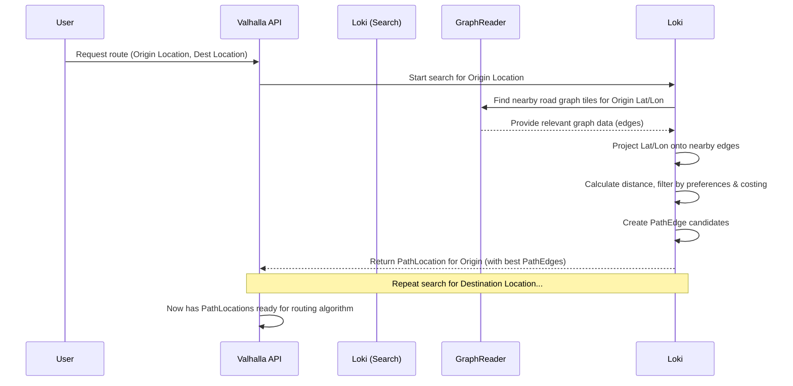

# Chapter 1: Location & PathLocation

Welcome to the Valhalla tutorial series! We're excited to guide you through the core concepts of this powerful open-source routing engine.

Imagine you want to get driving directions from your home to your favorite coffee shop using a map app. You type in the addresses, or maybe you just drop pins on the map. But how does the app know *exactly* which point on the road network corresponds to your pin, especially if the pin isn't perfectly on a road? This is where the concepts of `Location` and `PathLocation` come in.

In this first chapter, we'll explore:

*   What a `Location` represents (your initial pin drop).
*   What a `PathLocation` represents (the actual points on nearby roads).
*   How Valhalla converts a `Location` into a `PathLocation`.

Let's get started!

## The Problem: From Fuzzy Pin to Precise Road Point

Routing algorithms need precise start, end, and intermediate points *directly on* the road network graph they use. However, user input is often less precise:

*   A latitude/longitude coordinate might be slightly off the road.
*   It could be in the middle of a building or a park.
*   It might be near an intersection with multiple possible roads to start on.

Valhalla needs a way to take this potentially fuzzy input (`Location`) and find the most likely, usable points on the actual road network (`PathLocation`).

## What is a `Location`? The User's Input

Think of a `Location` as the raw information provided by the user (or another system) about a point of interest. It's like dropping a pin on a digital map.

The most crucial piece of information in a `Location` is the **latitude and longitude** (`latlng_`).

```cpp
// Simplified view of Location creation
// File: baldr/location.cc

midgard::PointLL coords(40.7128, -74.0060); // Lat/Lon for New York City Hall
Location::StopType type = Location::StopType::BREAK; // Is it a start, end, or via-point?
unsigned int radius = 50; // Search radius in meters

// Other optional info (can be default):
// - heading: Which direction are you facing?
// - preferred_side: Do you want to be on the same side of the street?
// - search_filter: Avoid tunnels, tolls, etc.?

// Create the Location object (simplified constructor)
baldr::Location user_location(coords, type, /*...*/ radius, /*...*/);

// user_location now holds the raw input pin data.
```

This `Location` object simply stores the input coordinates and any preferences the user might have, like avoiding tolls or preferring to arrive on a specific side of the street. It doesn't yet know anything about the actual roads nearby.

## What is a `PathLocation`? Snapping to the Road Network

A `PathLocation` is an enhanced version of a `Location`. It's created *after* Valhalla takes the input `Location` and correlates it with its internal road map data ([GraphTile & GraphReader](02_graphtile___graphreader.md)).

Think of it like this: You dropped a pin (`Location`), and Valhalla looked around that pin on its map, found the nearest roads, and identified specific points on those roads that you could actually start or end your journey on. The `PathLocation` holds these findings.

A `PathLocation` contains:

1.  All the original `Location` information.
2.  A list of candidate **`PathEdge`s**.

What's a `PathEdge`? It represents a potential connection point on a specific road segment in Valhalla's graph.

```cpp
// Simplified view of PathEdge
// File: baldr/pathlocation.h

struct PathEdge {
  GraphId id;               // Unique ID of the road segment ([GraphId](04_graphid.md))
  double percent_along;     // How far along the edge is this point (0.0 to 1.0)?
  midgard::PointLL projected;// The exact Lat/Lon of the point *on* the road.
  double distance;          // How far is this projected point from the original Location pin?
  // ... other info like side-of-street, reachability ...
};

// Simplified view of PathLocation
// File: baldr/pathlocation.h

struct PathLocation : public Location { // Inherits from Location
  std::vector<PathEdge> edges; // List of potential road connection points
  std::vector<PathEdge> filtered_edges; // Edges filtered out by preferences (heading, etc.)

  // Constructor takes the original Location
  PathLocation(const Location& location) : Location(location) {
      // Ready to store PathEdges found during search
  }
};
```

So, a `PathLocation` essentially says: "Okay, based on your input pin (`Location`), here are the most likely places on the actual road network (`edges`) where you could be."

## How `Location` Becomes `PathLocation`: The Search Process

The magic happens in a process often called "correlation" or "search". Valhalla's `Loki` component is responsible for this. Here's a high-level overview:

1.  **Input:** `Loki` receives one or more `Location` objects (e.g., origin and destination).
2.  **Find Nearby Tiles:** For each `Location`, it figures out which map data tiles ([GraphTile & GraphReader](02_graphtile___graphreader.md)) are nearby based on the latitude and longitude.
3.  **Search Edges:** It searches within those tiles for road segments (`DirectedEdge` - see [DirectedEdge & NodeInfo](03_directededge___nodeinfo.md)) that are close to the `Location`'s coordinates. The `radius_` parameter in the `Location` helps limit this search.
4.  **Project Point:** For each nearby road segment, it calculates the mathematically closest point on that segment to the input `Location`'s coordinates.
5.  **Filter Candidates:** It filters these potential points based on:
    *   `Location` preferences (heading, side of street, avoid tolls/tunnels/ferries, etc.).
    *   The costing model being used ([DynamicCost (Costing)](05_dynamiccost__costing_.md)) - e.g., a pedestrian route won't snap to a motorway.
    *   Reachability checks (can you actually reach this road segment?).
6.  **Create `PathEdge`s:** For the suitable candidate points, it creates `PathEdge` objects, storing information like the road segment's ID ([GraphId](04_graphid.md)), the calculated point (`projected`), the distance from the original pin, and the percentage along the segment.
7.  **Output:** It creates a `PathLocation` object, populating its `edges` list with the best `PathEdge` candidates found (sorted by distance). Filtered-out edges might be stored in `filtered_edges` for potential retries.

Here's a simplified diagram of the process:



The core function performing this is `loki::Search`:

```cpp
// Simplified call to the Search function
// File: loki/route_action.cc (or loki/locate_action.cc)

// Input: A list of user-provided locations
std::vector<baldr::Location> input_locations;
// ... populate input_locations ...

// Access to map data
GraphReader& reader = /* ... get graph reader ... */;
// Rules for travel (e.g., driving, walking)
std::shared_ptr<DynamicCost> costing = /* ... get costing object ... */;

// Perform the search!
// This returns a map linking each input Location to its corresponding PathLocation
std::unordered_map<baldr::Location, PathLocation> projections =
    loki::Search(input_locations, reader, costing);

// Now 'projections' contains the snapped results for each input location.
// Example: projections[input_locations[0]] is the PathLocation for the origin.
```

This `Search` function takes the raw `Location`s and, using the `GraphReader` to access map data and the `costing` rules, produces the `PathLocation`s needed for the next steps in routing.

## Why Multiple `PathEdge`s?

You might wonder why a `PathLocation` stores a *list* of `PathEdge`s instead of just the single closest one. There are several reasons:

*   **Ambiguity:** The input pin might be equidistant from two parallel roads, or right at an intersection where multiple roads meet.
*   **Preferences:** The absolute closest point might be on a road the user wants to avoid (e.g., a toll road) or might not match their heading preference. The second or third closest might be a better match.
*   **Routing Flexibility:** The main routing algorithm ([PathAlgorithm (Dijkstra/A*)](06_pathalgorithm__dijkstra_a__.md)) works better if it has a few slightly different starting/ending points to evaluate. Sometimes, starting on a road slightly further away might lead to a much faster overall route.

By providing a list of good candidates, Valhalla allows the routing algorithm to make the best choice in the context of the entire route, not just the initial snapping distance.

## Conclusion

In this chapter, we learned about two fundamental concepts in Valhalla:

*   `Location`: Represents the raw user input for a point of interest, primarily latitude and longitude, along with optional preferences. It's the "pin drop".
*   `PathLocation`: An enhanced version created by snapping the `Location` to the road network. It contains a list of `PathEdge`s, which are specific, usable points on nearby road segments.

The process of converting a `Location` to a `PathLocation` involves searching nearby road data, projecting the point, filtering candidates based on preferences and costing, and storing the best results. This crucial step ensures that the routing algorithm has precise points on the graph to work with.

But how does Valhalla store and efficiently access this road network data? That's what we'll explore in the next chapter!

**Next Up:** [Chapter 2: GraphTile & GraphReader](02_graphtile___graphreader.md)

---

Generated by [AI Codebase Knowledge Builder](https://github.com/The-Pocket/Tutorial-Codebase-Knowledge)