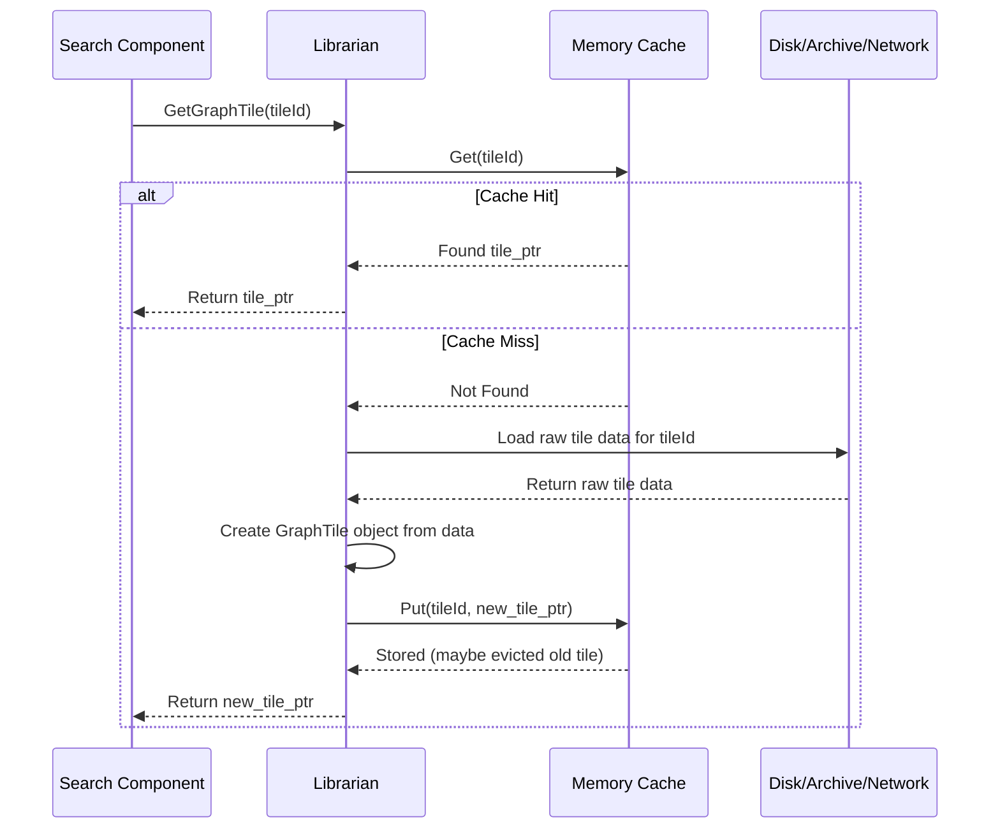

# Chapter 2: GraphTile & GraphReader

In [Chapter 1: Location & PathLocation](01_location___pathlocation.md), we saw how Valhalla takes a user's general `Location` (like a pin drop) and finds precise points (`PathLocation`) on the road network. But how does Valhalla *know* about the road network itself? Where is all that map data stored, and how does Valhalla access it quickly when you ask for a route?

Imagine the entire world's road network as a *massive*, incredibly detailed map book. It's far too big to read all at once! This chapter introduces two key concepts that help Valhalla manage and use this giant map book efficiently:

*   **`GraphTile`**: A single "chapter" or section of the map book, covering a specific geographic area.
*   **`GraphReader`**: The "librarian" who knows how to find, fetch, and manage these chapters for you.

Let's dive into how Valhalla organizes its map!

## The Problem: Accessing a Giant Map Efficiently

Digital maps contain a huge amount of information: roads, intersections, speed limits, turn restrictions, addresses, points of interest, and much more. Loading the entire world's map data into memory whenever you want to find a route would be incredibly slow and memory-intensive, likely impossible on most devices.

Valhalla needs a way to:

1.  **Divide the data:** Break the huge map into smaller, manageable chunks based on geographic area.
2.  **Load only what's needed:** When calculating a route or searching near a location, only load the map chunks relevant to that specific area.
3.  **Access data quickly:** Retrieve the necessary map details efficiently, using techniques like caching.

This is where `GraphTile` and `GraphReader` come in.

## What is a `GraphTile`? A Chapter of the Map

Think of a `GraphTile` as one chapter in our giant map book. Each `GraphTile` represents a specific rectangular geographic area (a "tile") and contains all the road network details needed for routing within that area.

Specifically, a `GraphTile` holds structured data like:

*   **Nodes (`NodeInfo`)**: Represent intersections or endpoints of road segments. ([DirectedEdge & NodeInfo](03_directededge___nodeinfo.md))
*   **Directed Edges (`DirectedEdge`)**: Represent road segments in one direction of travel between two nodes. ([DirectedEdge & NodeInfo](03_directededge___nodeinfo.md))
*   **Edge Information**: Details about road segments like names, shapes (geometry), speed limits, surface types, etc.
*   **Connectivity**: How different road segments connect at intersections.
*   **Attributes**: Information like turn restrictions, access restrictions (e.g., private roads), traffic signs, administrative boundaries, etc.
*   **Transit Data**: Information about public transport routes, stops, and schedules (if included).
*   **Unique IDs (`GraphId`)**: A system for uniquely identifying every node and edge within the tile and across the entire map. ([GraphId](04_graphid.md))

```cpp
// Simplified conceptual view of GraphTile contents
// (Actual implementation involves pointers into a memory block)
// File: baldr/graphtile.h

class GraphTile {
public:
  // Get the header containing metadata about the tile
  const GraphTileHeader* header() const;

  // Get a specific NodeInfo using its index within the tile
  const NodeInfo* node(uint32_t index) const;

  // Get a specific DirectedEdge using its index within the tile
  const DirectedEdge* directededge(uint32_t index) const;

  // Get detailed info (shape, names, etc.) for an edge
  EdgeInfo edgeinfo(const DirectedEdge* edge) const;

  // ... methods to access other data like signs, transit, restrictions ...

private:
  // Pointer to the raw data loaded from disk/memory
  std::unique_ptr<const GraphMemory> memory_;
  GraphTileHeader* header_;
  NodeInfo* nodes_;
  DirectedEdge* directededges_;
  // ... pointers to other data sections ...
};

// A smart pointer type often used for GraphTiles
using graph_tile_ptr = std::shared_ptr<const GraphTile>;
```

This structure allows Valhalla to load just the necessary "chapter" (`GraphTile`) for a specific region, containing all the relevant details in an organized format. The data itself is often pre-processed into a highly optimized binary format for fast loading and reading.

## What is a `GraphReader`? The Map Librarian

If `GraphTile`s are the chapters, the `GraphReader` is the librarian. It's the main component responsible for providing access to the `GraphTile` data needed by other parts of Valhalla (like the routing engine or the location searching component we saw in Chapter 1).

The `GraphReader` knows:

*   **Where the data is:** Is it stored as individual files on disk? Is it packed into a large archive file (like a `.tar`)? Is it available over a network?
*   **How to load it:** It handles the logic for reading tile data from its source.
*   **How to cache it:** It manages a cache (usually in memory) to keep frequently used tiles readily available, avoiding repeated loading from slower sources like disk or network.

Think of asking the librarian for "Chapter 40.7, -74.0" (representing a tile near New York City). The `GraphReader` checks if it already has that chapter handy in its cache. If yes, it gives it to you immediately. If not, it goes to the "shelf" (disk, archive file, or network), fetches the chapter, possibly puts a copy in the cache for next time, and then gives it to you.

```cpp
// Simplified conceptual view of GraphReader
// File: baldr/graphreader.h

class GraphReader {
public:
  // Constructor: Needs configuration like where tiles are stored
  GraphReader(const boost::property_tree::ptree& config);

  // The main method: Get a tile based on its ID
  // Returns a smart pointer to the tile (or nullptr if not found)
  graph_tile_ptr GetGraphTile(const GraphId& graphid);

  // Check if a tile exists (without loading it fully)
  bool DoesTileExist(const GraphId& graphid) const;

  // Clear the cache
  void ClearCache();

  // Is the cache using too much memory?
  bool OverCommitted() const;
  // Trim the cache if overcommitted
  void Trim();

  // ... other helper methods ...

private:
  // Where to find tile files (e.g., "/path/to/valhalla_tiles")
  std::string tile_dir_;
  // Optional: For accessing tiles packed in a .tar archive
  std::unique_ptr<tile_extract_t> tile_extract_;
  // Optional: For fetching tiles from a URL
  std::string tile_url_;
  std::unique_ptr<tile_getter_t> tile_getter_;

  // The cache manager (could be LRU, simple map, etc.)
  std::unique_ptr<TileCache> cache_;
};
```

The `GraphReader` acts as an abstraction layer. Other parts of Valhalla don't need to worry about *how* the tiles are stored or cached; they just ask the `GraphReader` for the tile they need using its `GraphId`.

## How It Works: Getting a Tile

Let's trace what happens when a part of Valhalla, like the `Loki` search component from Chapter 1, needs map data for a specific area.

1.  **Identify Needed Tile:** `Loki` determines the `GraphId` of the tile covering the `Location` it needs to search. A `GraphId` contains the tile's unique identifier and its level in the hierarchy ([TileHierarchy](07_tilehierarchy.md)).
2.  **Request Tile:** `Loki` calls `graphReader.GetGraphTile(neededTileId)`.
3.  **Check Cache:** The `GraphReader` first checks its internal `TileCache`. Does it already have this tile loaded in memory?
4.  **Cache Hit:** If yes, the `GraphReader` instantly returns a pointer (`graph_tile_ptr`) to the cached `GraphTile`. Fast!
5.  **Cache Miss:** If no, the `GraphReader` needs to load it:
    *   **From Archive (`tile_extract_`)?** If configured to use a tile archive (like `tiles.tar`), it finds the tile's data within the mapped archive file.
    *   **From Disk (`tile_dir_`)?** If configured to use individual files, it constructs the file path (e.g., `/valhalla_tiles/0/0/0/1.gph` or `.gph.gz`) and reads the file. It might need to decompress it if it's gzipped.
    *   **From Network (`tile_url_`)?** If configured with a URL, it fetches the tile data over the network using the `tile_getter_`. It might save a copy to the `tile_dir_` for future use.
6.  **Create Tile Object:** Once the raw tile data is loaded (as a block of memory), the `GraphReader` (often via `GraphTile::Create` or `GraphTile::DecompressTile`) uses this data to construct a `GraphTile` object. This involves setting up pointers within the `GraphTile` to correctly interpret the binary data.
7.  **Store in Cache:** The `GraphReader` puts the newly loaded `GraphTile` into its `TileCache` (using `cache_->Put(...)`). If the cache is full, it might remove older or less frequently used tiles first (e.g., using an LRU - Least Recently Used - strategy).
8.  **Return Tile:** The `GraphReader` returns the pointer (`graph_tile_ptr`) to the newly loaded `GraphTile`.

Here's a simplified diagram:



## Example: Using the GraphReader

Let's say we have a `GraphId` representing a specific tile (we'll learn more about `GraphId` in [Chapter 4: GraphId](04_graphid.md)) and a configured `GraphReader`. Getting the tile looks like this:

```cpp
// Assume 'reader' is an already configured GraphReader instance
// Assume 'some_graph_id' is a valid GraphId for a tile we need
// File: somewhere_in_loki_or_thor.cc (conceptual)

baldr::GraphId needed_tile_id = /* ... get GraphId for desired tile ... */;

// Ask the reader for the tile
baldr::graph_tile_ptr tile = reader.GetGraphTile(needed_tile_id);

if (tile) {
  // Success! We have the tile data.
  // Now we can access its contents, e.g., find nodes or edges.
  const baldr::GraphTileHeader* header = tile->header();
  std::cout << "Loaded tile: " << header->graphid()
            << " with " << header->nodecount() << " nodes." << std::endl;

  // Use the tile data for searching, routing, etc.
  // const baldr::NodeInfo* node = tile->node(some_node_index);
  // ...

} else {
  // Tile couldn't be found or loaded. Handle the error.
  std::cerr << "Error: Tile " << needed_tile_id << " not found!" << std::endl;
}
```

This simple `GetGraphTile` call hides all the complexity of caching and loading from different sources.

## Under the Hood: Caching and Loading

The `GraphReader` relies heavily on its `TileCache` component. Valhalla offers different caching strategies:

*   **`FlatTileCache`**: Uses a fixed-size vector, suitable when tile IDs are predictable and fit within the vector size. Very fast lookup but less flexible.
*   **`SimpleTileCache`**: Uses a standard hash map (`std::unordered_map`). Flexible but potentially slower than `FlatTileCache`.
*   **`TileCacheLRU`**: Uses a hash map linked with a list to implement a Least Recently Used eviction policy. When the cache is full and a new tile needs to be added, the least recently used tile is removed. This is often a good balance between performance and memory management.

The choice of cache and its size is configured when Valhalla starts.

```cpp
// Simplified GetGraphTile logic
// File: baldr/graphreader.cc

graph_tile_ptr GraphReader::GetGraphTile(const GraphId& graphid) {
  // Check cache first
  if (const auto& cached = cache_->Get(graphid.Tile_Base())) {
    // Cache Hit!
    return cached;
  }

  // Cache Miss - Load the tile
  graph_tile_ptr tile = nullptr;

  // Try loading from pre-extracted archive (if configured)
  if (!tile_extract_->tiles.empty()) {
    // ... find data pointer in tile_extract_->tiles ...
    // ... create memory object for the data slice ...
    tile = GraphTile::Create(graphid.Tile_Base(), /* memory */, /* traffic_memory */);
  }
  // Try loading from individual files on disk (if configured)
  else if (!tile_dir_.empty()) {
    // ... try reading file path based on graphid ...
    // ... might involve decompression if it's .gz ...
    tile = GraphTile::Create(tile_dir_, graphid.Tile_Base(), /* traffic_memory */);
  }

  // If still not loaded, try fetching from URL (if configured)
  if (!tile && tile_getter_) {
    // ... fetch tile data using tile_getter_ ...
    // ... potentially cache to disk in tile_dir_ ...
    // ... decompress if needed ...
    tile = GraphTile::CacheTileURL(tile_url_, graphid.Tile_Base(), tile_getter_.get(), tile_dir_);
  }

  // If successfully loaded, put it in the cache
  if (tile) {
    const size_t size = /* estimate or get actual tile size */;
    return cache_->Put(graphid.Tile_Base(), std::move(tile), size);
  }

  // Couldn't load the tile
  return nullptr;
}
```

The `GraphTile::Create` and `GraphTile::CacheTileURL` functions handle the details of interpreting the raw binary data and constructing the `GraphTile` object.

## Conclusion

Organizing the vast road network data into manageable `GraphTile`s (chapters) and using a `GraphReader` (librarian) to efficiently access them is crucial for Valhalla's performance.

In this chapter, we learned:

*   A `GraphTile` stores all road network data for a specific geographic area.
*   A `GraphReader` acts as an interface to fetch these tiles, managing loading from disk, archives, or networks, and utilizing a `TileCache` for speed.
*   Other Valhalla components simply ask the `GraphReader` for the `GraphTile` they need using a `GraphId`.

Now that we know how Valhalla accesses the map data chapters, what exactly is *inside* those chapters? How are roads and intersections represented? Let's look closer at the fundamental building blocks within a `GraphTile` in the next chapter.

**Next Up:** [Chapter 3: DirectedEdge & NodeInfo](03_directededge___nodeinfo.md)

---

Generated by [AI Codebase Knowledge Builder](https://github.com/The-Pocket/Tutorial-Codebase-Knowledge)