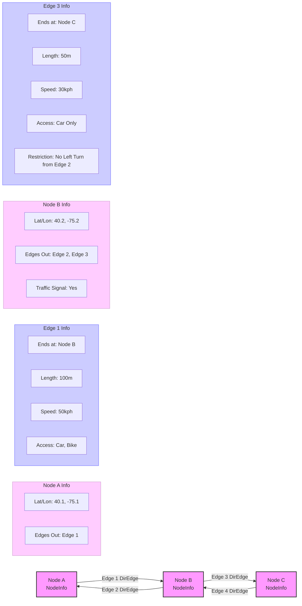

# Chapter 3: DirectedEdge & NodeInfo - The Roads and Intersections

In [Chapter 2: GraphTile & GraphReader](02_graphtile___graphreader.md), we learned that Valhalla organizes its map data into chapters called `GraphTile`s, and uses a `GraphReader` (our librarian) to manage them. We know how to get a specific "chapter" for a geographic area.

But what's *inside* these chapters? If you open a `GraphTile`, what does the road network actually look like? How does Valhalla represent a specific intersection or a stretch of highway?

This chapter introduces the two most fundamental building blocks inside a `GraphTile`:

*   **`NodeInfo`**: Represents a point on the map, typically an intersection or a place where road details change. Think of it as a *junction*.
*   **`DirectedEdge`**: Represents a one-way segment of a road connecting two `NodeInfo` points. Think of it as a *one-way street*.

These are the atoms and molecules that Valhalla uses to build its understanding of the world's roads.

## The Problem: Representing a Complex Road Network

Imagine trying to describe a road network to a computer so it can find routes. You need a structured way to represent:

*   Where roads meet (intersections).
*   The paths roads take between intersections.
*   Details about those paths (Are they one-way? What's the speed limit? Is it a bridge?).
*   Details about the intersections (Is there a traffic light? Which turns are allowed?).

Valhalla solves this by modeling the road network as a **graph**. In graph theory terms, intersections are **nodes** (or vertices), and the road segments connecting them are **edges**. Valhalla uses `NodeInfo` for the nodes and `DirectedEdge` for the edges.

## What is a `NodeInfo`? The Junctions

A `NodeInfo` object represents a specific point in the graph. This could be:

*   An intersection where two or more roads meet.
*   A point where a road significantly changes its characteristics (e.g., the speed limit changes, the road becomes a bridge).
*   The end of a dead-end street.
*   A transit stop or a bike-share station.

Think of it like placing a pin on a specific junction or significant point on your map. What information does that pin need?

A `NodeInfo` stores crucial details about that point:

*   **Location (`latlng_`)**: The precise latitude and longitude, often stored efficiently as an offset from the `GraphTile`'s corner ([Chapter 2: GraphTile & GraphReader](02_graphtile___graphreader.md)).
*   **Elevation (`elevation_`)**: How high above sea level this point is.
*   **Connections (`edge_index_`, `edge_count_`)**: Information about which `DirectedEdge`s (roads) start *from* this node.
*   **Type (`type_`)**: Is it a regular street intersection, a highway junction, a transit stop, etc.?
*   **Access (`access_`)**: Which types of vehicles or pedestrians are allowed to pass *through* this node?
*   **Attributes (`traffic_signal_`, etc.)**: Does this node have a traffic signal? Are there turn restrictions originating here?

```cpp
// Highly simplified conceptual view of NodeInfo
// Actual struct uses bit-packing for efficiency
// File: baldr/nodeinfo.h

struct NodeInfo {
  // Location Data
  uint32_t lat_offset_; // Offset from tile corner latitude
  uint32_t lon_offset_; // Offset from tile corner longitude
  uint16_t elevation_;  // Packed elevation value

  // Connection Data
  uint32_t edge_index_; // Index of the first outgoing DirectedEdge in the tile
  uint8_t edge_count_;  // How many DirectedEdges start at this node?

  // Attributes
  uint16_t access_;         // Which vehicle/pedestrian types can pass through? (Bitmask)
  NodeType type_ : 4;       // Type of node (street, highway, transit...)
  bool traffic_signal_ : 1; // Is there a traffic light here?
  // ... many other packed attributes (intersection type, drive side, etc.) ...
};

// Function to get the actual Lat/Lon (needs tile's base coordinates)
midgard::PointLL NodeInfo::latlng(const midgard::PointLL& tile_base_ll) const {
  // ... logic to combine base_ll with lat/lon offsets ...
  return calculated_lat_lon;
}

// Function to get the elevation in meters
float NodeInfo::elevation() const {
  // ... logic to unpack elevation_ ...
  return calculated_elevation;
}
```

This `NodeInfo` gives Valhalla all the details about a specific *point* on the road network graph.

## What is a `DirectedEdge`? The One-Way Streets

A `DirectedEdge` represents a segment of a road connecting two `NodeInfo` points, but crucially, it represents travel in **only one direction**.

Think of a typical two-way street. In Valhalla's graph, this single street is actually represented by *two* `DirectedEdge` objects:
1.  One `DirectedEdge` going from Node A to Node B.
2.  Another `DirectedEdge` going from Node B to Node A.

This is essential because road attributes can differ by direction (e.g., turn restrictions, speed limits during rush hour on some roads).

What information does Valhalla need about this one-way road segment?

*   **Destination (`endnode_`)**: The `GraphId` ([Chapter 4: GraphId](04_graphid.md)) of the `NodeInfo` where this directed edge *ends*. (The starting node is implicitly the `NodeInfo` that points to this edge).
*   **Length (`length_`)**: The length of this road segment in meters.
*   **Speed (`speed_`, `truck_speed_`, etc.)**: Various speed limits or typical speeds (e.g., free-flow, speed limit, truck speed).
*   **Road Class (`classification_`)**: Is it a major highway, a residential street, a path?
*   **Use (`use_`)**: Is it a regular road, a ferry route, a bike path, a walkway?
*   **Surface (`surface_`)**: Paved, unpaved, cobblestone, etc.?
*   **Access (`forwardaccess_`, `reverseaccess_`)**: Which vehicle/pedestrian types are allowed on this specific edge segment? (Note: This is about *using* the edge, distinct from the node's `access_` which is about *passing through* the intersection).
*   **Attributes (`toll_`, `tunnel_`, `bridge_`, `roundabout_`, `restrictions_`, etc.)**: Is it a toll road? A tunnel? Part of a roundabout? Are there turn restrictions *from* this edge at its end node?

```cpp
// Highly simplified conceptual view of DirectedEdge
// Actual struct uses many bit-fields for efficiency
// File: baldr/directededge.h

struct DirectedEdge {
  // Connectivity & Identification
  uint64_t endnode_;        // GraphId value of the node this edge leads TO
  uint32_t edgeinfo_offset_; // Offset to find shared EdgeInfo (names, shape)
  uint32_t opp_index_;      // Index to the opposing DirectedEdge (if it exists)

  // Core Routing Attributes
  uint16_t length_;              // Length in meters
  uint8_t speed_;                // Typical speed (KPH)
  RoadClass classification_ : 5; // Highway, primary, residential, etc.
  Use use_ : 6;                  // Road, ferry, path, steps, etc.
  Surface surface_ : 4;          // Paved, unpaved, etc.

  // Access & Restrictions
  uint16_t forwardaccess_; // Allowed travel modes in this edge's direction
  uint16_t reverseaccess_; // Allowed travel modes in the opposing edge's direction
  uint8_t restrictions_;   // Simple turn restrictions mask at the end node

  // Flags & Other Attributes
  bool toll_ : 1;           // Is this a toll road segment?
  bool tunnel_ : 1;         // Is this a tunnel segment?
  bool bridge_ : 1;         // Is this a bridge segment?
  bool roundabout_ : 1;     // Is this part of a roundabout?
  bool forward_ : 1;        // Is this edge stored forward relative to shared EdgeInfo?
  // ... many other packed attributes (grade, curvature, cycle lane, etc.) ...
};
```

A `DirectedEdge` provides the details needed to understand the cost and constraints of traveling along a specific one-way piece of road.

## Putting It Together: The Graph Structure

Inside a `GraphTile`, `NodeInfo`s and `DirectedEdge`s work together. Each `NodeInfo` knows which `DirectedEdge`s *start* from it. Each `DirectedEdge` knows which `NodeInfo` it *ends* at.



In this simple example:
*   Nodes A, B, and C are `NodeInfo` objects.
*   Edges 1, 2, 3, and 4 are `DirectedEdge` objects.
*   Node B knows that Edge 2 and Edge 3 start from it.
*   Edge 1 knows that it ends at Node B. Edge 3 knows it ends at Node C.
*   Each node and edge stores relevant attributes (like location, length, speed, access, signals, restrictions).

This interconnected structure allows routing algorithms like Dijkstra or A* ([PathAlgorithm (Dijkstra/A*)](06_pathalgorithm__dijkstra_a__.md)) to explore the road network, calculating costs and finding the best path.

## Accessing Nodes and Edges from a Tile

How do we get a specific `NodeInfo` or `DirectedEdge` once we have a `GraphTile`? Remember from [Chapter 2: GraphTile & GraphReader](02_graphtile___graphreader.md) that the `GraphReader` gives us a pointer to the `GraphTile` data. The `GraphTile` object itself provides methods to access its contents using an index.

```cpp
#include "baldr/graphreader.h"
#include "baldr/graphtile.h"
#include "baldr/graphid.h"
#include "baldr/nodeinfo.h"
#include "baldr/directededge.h"
#include <iostream>

// Assume 'reader' is an initialized GraphReader
// Assume 'some_tile_id' is the GraphId of the tile we need
valhalla::baldr::GraphReader& reader = /* ... get reader ... */;
valhalla::baldr::GraphId some_tile_id = /* ... tile ID ... */;

// 1. Get the tile from the reader
valhalla::baldr::graph_tile_ptr tile = reader.GetGraphTile(some_tile_id);

if (tile) {
  // Tile loaded successfully!

  // 2. Access a specific NodeInfo using its index within the tile
  // (Indices typically come from GraphIds or exploration)
  uint32_t node_index = 5; // Example node index
  if (node_index < tile->header()->nodecount()) {
    const valhalla::baldr::NodeInfo* node = tile->node(node_index);
    // Now 'node' points to the NodeInfo data for index 5
    std::cout << "Node " << node_index << " Elevation: "
              << node->elevation() << "m" << std::endl;
  }

  // 3. Access a specific DirectedEdge using its index within the tile
  uint32_t edge_index = 12; // Example edge index
  if (edge_index < tile->header()->directededgecount()) {
    const valhalla::baldr::DirectedEdge* edge = tile->directededge(edge_index);
    // Now 'edge' points to the DirectedEdge data for index 12
    std::cout << "Edge " << edge_index << " Length: "
              << edge->length() << "m" << std::endl;
    std::cout << "Edge " << edge_index << " Ends at Node ID: "
              << edge->endnode().value << std::endl;
  }
} else {
  std::cerr << "Failed to load tile: " << some_tile_id << std::endl;
}
```

The `GraphTile` acts like a container, holding arrays of `NodeInfo` and `DirectedEdge` structures. We can access specific elements using their index if we know which one we need. How do we know which index corresponds to which real-world location? That's where the `GraphId` ([Chapter 4: GraphId](04_graphid.md)) comes in, linking the tile, the element type (node/edge), and its index together.

## Under the Hood: Optimized Storage

You might notice the code snippets mention "bit-packing" and "offsets". Inside the `GraphTile` file on disk, `NodeInfo` and `DirectedEdge` data isn't stored quite as cleanly as the simplified structs above. To save space and speed up loading, Valhalla uses several tricks:

*   **Bit-fields:** Many boolean flags (like `toll_`, `bridge_`) and small integer values (like `classification_`, `surface_`) are packed together into single bytes or integers.
*   **Offsets:** Instead of storing full latitude/longitude, `NodeInfo` stores smaller offsets relative to the tile's corner.
*   **Shared Data (`EdgeInfo`)**: Information common to both directions of a road segment (like its name, detailed geometry/shape) is stored separately in an `EdgeInfo` structure. The `DirectedEdge` just stores an `edgeinfo_offset_` to find this shared data, avoiding duplication.
*   **Contiguous Arrays:** Within the loaded tile data, nodes and edges are often stored in large, contiguous arrays, which is generally faster for the computer to access.

You don't usually need to worry about these details when *using* Valhalla's core components, as functions like `node->elevation()` or `edge->length()` handle the unpacking for you. But it helps to know that the underlying storage is highly optimized.

*(Note: The actual creation of these packed structures from raw map data like OpenStreetMap happens in a separate Valhalla component called Mjolnir, using builder classes like `NodeInfoBuilder` and `DirectedEdgeBuilder`.)*

## Conclusion

We've now met the fundamental building blocks of Valhalla's road network graph:

*   **`NodeInfo`**: Represents junctions or significant points, storing location, elevation, connections, and intersection attributes.
*   **`DirectedEdge`**: Represents a one-way road segment between two nodes, storing length, speed, road class, access restrictions, and other attributes relevant for routing.

These structures, contained within `GraphTile`s ([Chapter 2: GraphTile & GraphReader](02_graphtile___graphreader.md)), form the detailed map representation that Valhalla's routing algorithms traverse.

But how does Valhalla uniquely identify *every single node and edge* across the entire world, even across different tiles? How does a `DirectedEdge` refer to its `endnode_`? We need a global addressing system. That's the role of the `GraphId`, which we'll explore next.

**Next Up:** [Chapter 4: GraphId](04_graphid.md)

---

Generated by [AI Codebase Knowledge Builder](https://github.com/The-Pocket/Tutorial-Codebase-Knowledge)