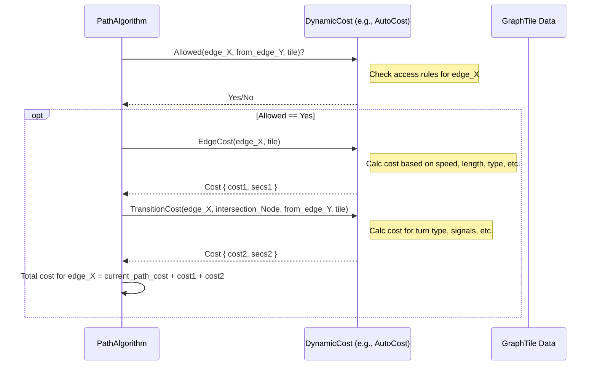

# Chapter 5: DynamicCost (Costing) - What's the "Best" Path?

In [Chapter 4: GraphId](04_graphid.md), we learned how Valhalla uses `GraphId`s as unique addresses for every piece of the map graph. We know how to identify specific roads (`DirectedEdge`) and intersections (`NodeInfo`).

But how does Valhalla decide which sequence of roads makes the "best" route? If you ask for directions from home to work, there might be many possible paths. Some might be shorter, some faster, some might avoid highways, and some might use bike paths. How does the routing engine choose?

This is where **costing** comes in. It's not just about money; "cost" in Valhalla is a measure of effort, time, or preference for traveling along a certain path. This chapter introduces the `DynamicCost` concept, which acts like a customizable rulebook for calculating this cost.

We'll explore:

*   What "cost" means in Valhalla.
*   How `DynamicCost` provides different rulebooks (costing models) for different travel modes (car, bike, pedestrian, etc.).
*   How these rulebooks determine the cost of using roads and making turns.

Let's figure out how Valhalla weighs the options!

## The Problem: Defining the "Best" Route

Imagine you want directions:

*   **Driving:** You probably want the *fastest* route, maybe avoiding tolls or heavy traffic if possible. You'll happily use highways.
*   **Cycling:** You might want a balance between speed and safety, preferring bike lanes or quieter streets, avoiding major highways, and maybe considering hills.
*   **Walking:** You want the *shortest* path using sidewalks and pedestrian paths, avoiding highways entirely, and perhaps minimizing stair climbing.

The "best" path clearly depends on *how* you're traveling. Valhalla needs a way to quantify these different preferences and constraints to guide the routing algorithm. Simply finding the physically shortest path isn't always right.

## What is "Cost"? More Than Just Time

In Valhalla, the **cost** of traversing a road segment (`DirectedEdge`) or making a turn at an intersection (`NodeInfo`) isn't just one thing like time or distance. It's a calculated numerical value that represents the overall "effort" or "desirability" based on the chosen travel mode and user preferences.

This cost is influenced by many factors:

*   **Time:** How long does it take to travel the segment or make the turn? (Based on speed, length, traffic, turn complexity).
*   **Distance:** How long is the segment? (Sometimes relevant, especially for walking or if the user prefers shorter routes).
*   **Road Type Preference:** Does the travel mode prefer highways (like cars) or avoid them (like pedestrians)? Does it prefer bike lanes?
*   **Surface Type:** Is the road paved, gravel, or dirt? A road bike will heavily penalize gravel, while a mountain bike might not.
*   **Elevation Changes:** How steep is the road? This matters a lot more for biking and walking than driving.
*   **Penalties:** Extra costs added for undesirable things like:
    *   Toll roads
    *   Making U-turns
    *   Using ferries
    *   Crossing borders
    *   Passing through gates
    *   Using steps (for pedestrians)
    *   Turning across traffic at busy intersections

The routing algorithm's goal is always to find the path with the *lowest total cost* from start to finish, according to the specific costing rules being used.

## `DynamicCost`: The Rulebook Abstraction

How does Valhalla manage all these different rules for cars, bikes, pedestrians, trucks, etc.? It uses an abstraction called `DynamicCost`.

Think of `DynamicCost` as a *template* for a rulebook. It defines the basic questions a routing algorithm needs answered to calculate costs, but it doesn't fill in the answers itself.

```cpp
// Very simplified conceptual view of the DynamicCost interface
// File: sif/dynamiccost.h

class DynamicCost {
public:
  virtual ~DynamicCost() {} // Virtual destructor is important!

  // Can this mode even use this edge/make this turn?
  virtual bool Allowed(const baldr::DirectedEdge* edge, /*...other context...*/) const = 0;
  virtual bool AllowedReverse(/*...similar context for reverse search...*/) const = 0;

  // What's the cost to travel along this edge?
  virtual Cost EdgeCost(const baldr::DirectedEdge* edge, /*...other context...*/) const = 0;

  // What's the cost to turn from the previous edge onto this one?
  virtual Cost TransitionCost(const baldr::DirectedEdge* edge, const baldr::NodeInfo* node, /*...other context...*/) const = 0;
  virtual Cost TransitionCostReverse(/*...similar context...*/) const = 0;

  // Factor for A* heuristic estimation (more in Chapter 6)
  virtual float AStarCostFactor() const = 0;

  // What type of travel is this? (e.g., car, bike, pedestrian)
  virtual uint8_t travel_type() const = 0;
  virtual TravelMode travel_mode() const = 0;

  // ... other helper methods ...
protected:
  // Common settings parsed from user options
  bool shortest_; // Is the user asking for shortest distance path?
  // ... many other shared options (avoid tolls, use highways preference, etc.)
};

// The 'Cost' structure returned by costing methods
// File: sif/cost.h
struct Cost {
  float cost; // The calculated cost value used for pathfinding priority
  float secs; // The estimated time in seconds for this segment/turn
  // ... constructors and operators ...
};

// A smart pointer type often used for DynamicCost objects
using cost_ptr_t = std::shared_ptr<DynamicCost>;
```

The key idea is that different **costing models** are created by inheriting from `DynamicCost` and implementing these virtual methods according to specific rules. Valhalla provides several built-in costing models:

*   `AutoCost`: For cars, generally prioritizes speed, uses highways. (sif/autocost.cc)
*   `BicycleCost`: For bicycles, considers bike lanes, elevation, surface, road class. (sif/bicyclecost.cc)
*   `PedestrianCost`: For walking, prioritizes shortest path on sidewalks/paths, avoids highways, penalizes steps/elevation. (sif/pedestriancost.cc)
*   `TruckCost`: For trucks, considers truck-specific restrictions (height, weight, hazmat), avoids residential areas. (sif/truckcost.cc)
*   `MotorcycleCost`: For motorcycles, similar to auto but may have different preferences (e.g., for twisty roads, surface tolerance). (sif/motorcyclecost.cc)
*   `MotorScooterCost`: For scooters, often avoids highways, considers speed limits. (sif/motorscootercost.cc)
*   `TransitCost`: For public transport, considers schedules, wait times, transfers. (sif/transitcost.cc)
*   `NoCost`: A simple costing that uses only distance, ignoring most attributes (useful for map matching). (sif/nocost.cc)

When you request a route, you specify which costing model to use (e.g., `"costing": "auto"` or `"costing": "bicycle"`), and Valhalla selects the appropriate `DynamicCost` implementation.

## How Routing Uses `DynamicCost`

The pathfinding algorithms, like Dijkstra or A* ([Chapter 6: PathAlgorithm (Dijkstra/A*)](06_pathalgorithm__dijkstra_a__.md)), explore the map graph step-by-step. At each intersection (`NodeInfo`), they look at the possible roads (`DirectedEdge`) they can take next. For each potential step, they ask the chosen `DynamicCost` object:

1.  **`Allowed()`**: "Can I even go this way?" If the costing model says no (e.g., a pedestrian trying to enter a highway, or a tall truck approaching a low bridge), that path is immediately discarded.
2.  **`EdgeCost()`**: "If I take this road segment, what's the cost?" The costing model calculates this based on its rules (speed, distance, road type, surface, etc.).
3.  **`TransitionCost()`**: "What's the extra cost for making the turn from the road I just came from onto this new one?" The costing model calculates this based on turn type, signals, U-turns, etc.

The algorithm adds the `EdgeCost` and `TransitionCost` to the total cost accumulated so far for that path. It keeps track of the lowest-cost path found to reach each intersection and continues exploring until it finds the lowest-cost path to the destination.



## Example: `AutoCost` vs. `BicycleCost` Rules

Let's look at how `EdgeCost` might differ between `AutoCost` and `BicycleCost` for the same road segment.

**Scenario:** A 1km segment of a primary road (`RoadClass::kPrimary`), paved (`Surface::kPaved`), with a speed limit of 60 kph, and a moderate uphill grade (`weighted_grade = 10`).

**`AutoCost::EdgeCost` (Simplified Logic):**

```cpp
// File: sif/autocost.cc (Simplified)
Cost AutoCost::EdgeCost(const baldr::DirectedEdge* edge, /*...*/) const {
  float length_meters = edge->length(); // 1000m
  // Get speed (assume 60 kph from edge data or traffic)
  uint32_t speed_kph = /*... tile->GetSpeed(...) ...*/ 60;
  float sec = length_meters * kSpeedFactor[speed_kph]; // e.g., 1000m / (60kph * 1000/3600) = 60 sec

  // Is 'shortest' path requested? If yes, cost is just distance.
  if (shortest_) { return Cost(length_meters, sec); }

  // Calculate base factor (density, ferry, etc. - assume 1.0 here)
  float factor = 1.0f;

  // Apply highway preference (Primary roads get 0 factor bonus/penalty)
  factor += highway_factor_ * kHighwayFactor[RoadClass::kPrimary]; // highway_factor_ * 0.0 = 0

  // Apply surface penalty (Paved surface gets 0 factor penalty)
  factor += surface_factor_ * kSurfaceFactor[Surface::kPaved]; // surface_factor_ * 0.0 = 0

  // Apply toll penalty (Assume no toll: edge->toll() = false)
  factor += edge->toll() * toll_factor_; // 0 * toll_factor_ = 0

  // Apply speed penalties (if any, depends on traffic/time) - assume 0 here
  factor += SpeedPenalty(edge, /*...*/);

  // Combine time and distance based on user preference (use_distance)
  // Assume default use_distance = 0.0 (prioritize time)
  // inv_distance_factor_ = 1.0, distance_factor_ = 0.0
  float final_cost = (sec * inv_distance_factor_ + length_meters * distance_factor_) * factor;
                     // (60 * 1.0 + 1000 * 0.0) * 1.0 = 60.0

  return Cost(final_cost, sec); // Cost = 60.0, Time = 60.0 sec
}
```
*Result:* `AutoCost` calculates a cost primarily based on the travel time (60 seconds). Grade and surface don't significantly affect the cost for a car on a paved road.

**`BicycleCost::EdgeCost` (Simplified Logic):**

```cpp
// File: sif/bicyclecost.cc (Simplified)
Cost BicycleCost::EdgeCost(const baldr::DirectedEdge* edge, /*...*/) const {
  float length_meters = edge->length(); // 1000m
  uint8_t grade_index = edge->weighted_grade(); // 10 (moderate uphill)
  Surface surface = edge->surface(); // Paved

  // Calculate base bike speed based on type, surface, and grade
  // Assume hybrid bike (18 kph base), paved surface (factor 1.0), grade 10 (factor 0.65)
  float base_speed = speed_; // 18 kph
  float surface_speed_mult = surface_speed_factor_[surface]; // 1.0
  float grade_speed_mult = kGradeBasedSpeedFactor[grade_index]; // 0.65
  uint32_t bike_speed_kph = base_speed * surface_speed_mult * grade_speed_mult; // 18 * 1.0 * 0.65 = 11.7 kph

  // Calculate time in seconds
  float sec = length_meters * kSpeedFactor[bike_speed_kph]; // e.g., 1000m / (11.7 kph * 1000/3600) = 308 sec

  if (shortest_) { return Cost(length_meters, sec); }

  // Calculate base factor
  float factor = 1.0f;

  // Apply grade penalty based on user preference (use_hills)
  // Assume default use_hills = 0.25 -> avoid_hills = 0.75
  // Grade 10 penalty strength = 2.0
  factor += grade_penalty[grade_index]; // 0.75 * kAvoidHillsStrength[10] = 0.75 * 2.0 = 1.5

  // Apply road stress/accommodation factors
  // Primary road class penalty = 0.2
  // Assume use_roads = 0.25 -> road_factor = 2.0 - 0.25*2 = 1.5, avoid_roads = 0.75
  float roadway_stress = 1.0f;
  roadway_stress += road_factor_ * kRoadClassFactor[RoadClass::kPrimary]; // 1.5 * 0.2 = 0.3
  // Assume edge speed penalty factor = 1.0 (based on 60kph limit & use_roads)
  roadway_stress *= speedpenalty_[edge->speed()]; // (1.0 + 0.3) * 1.0 = 1.3
  // Assume no special cycle lanes/shoulders (accommodation_factor = 1.0)
  float accommodation_factor = 1.0f;

  // Add stress factor to overall factor
  factor += (accommodation_factor * roadway_stress); // 1.5 + (1.0 * 1.3) = 2.8

  // Apply surface factor (Paved is okay, no extra penalty)
  // factor += avoid_bad_surfaces_ * kSurfaceFactors[...]; // 0

  float final_cost = sec * factor; // 308 * (1.0 + 1.5 + 1.3) = 308 * 3.8 = 1170.4

  return Cost(final_cost, sec); // Cost = 1170.4, Time = 308 sec
}
```
*Result:* `BicycleCost` calculates a much higher time (308s vs 60s) due to the slower base speed and the grade significantly reducing speed. The cost (1170.4 vs 60.0) is further increased substantially by penalties for the uphill grade (`grade_penalty`) and the stress of cycling on a primary road (`roadway_stress`).

This example highlights how different costing models apply vastly different logic within the same `EdgeCost` method, leading to different path preferences.

## Configuring Costing Options

Users can influence costing behavior by providing options in their route request (usually as a JSON object). These options tune the preferences used within the chosen costing model.

For example, to make the `AutoCost` model less likely to use highways and tolls, you might send options like this:

```json
{
  "locations": [ /* ... */ ],
  "costing": "auto",
  "costing_options": {
    "auto": {
      "use_highways": 0.1, // Value between 0 (avoid) and 1 (prefer). Default is 0.5.
      "use_tolls": 0.1,    // Value between 0 (avoid) and 1 (prefer). Default is 0.5.
      "top_speed": 100     // Optional: Limit max speed considered (kph)
    }
  }
}
```

Inside Valhalla, functions like `ParseAutoCostOptions` read these JSON values and use them to initialize the member variables (like `highway_factor_`, `toll_factor_`, `top_speed_`) of the `AutoCost` object when it's created.

```cpp
// Simplified initialization in AutoCost constructor
// File: sif/autocost.cc
AutoCost::AutoCost(const Costing& costing, /*...*/)
    : DynamicCost(costing, /*...*/) {
  const auto& options = costing.options();

  // Parse 'use_highways' preference (0-1) and calculate internal 'highway_factor_'
  float use_highways = options.use_highways(); // Gets value from JSON/protobuf
  if (use_highways >= 0.5f) { /* calculate factor favoring highways */ }
  else { /* calculate factor penalizing highways */ }
  // highway_factor_ is now set based on user input

  // Parse 'use_tolls' preference (0-1) and calculate internal 'toll_factor_'
  float use_tolls = options.use_tolls(); // Gets value from JSON/protobuf
  if (use_tolls < 0.5f) { /* calculate factor penalizing tolls */ }
  else { /* calculate factor slightly favoring tolls */ }
  // toll_factor_ is now set based on user input

  top_speed_ = options.top_speed(); // Use user-provided top speed

  // ... initialize other factors based on options ...
}
```

This allows flexible control over routing behavior without changing the core algorithm.

## Conclusion

`DynamicCost` is Valhalla's powerful mechanism for defining what makes a path "good" for different ways of traveling.

*   It provides an abstract interface (`Allowed`, `EdgeCost`, `TransitionCost`).
*   Specific costing models (`AutoCost`, `BicycleCost`, etc.) implement this interface with mode-specific rules and penalties.
*   These rules consider time, distance, road types, surfaces, turns, tolls, elevation, and user preferences.
*   Routing algorithms query the chosen `DynamicCost` object to determine the cost of each potential step in the graph.
*   User-provided options allow customization of costing behavior.

By separating the *rules* of travel (costing) from the *process* of finding a path (algorithm), Valhalla achieves great flexibility in generating routes tailored to different needs.

Now that we understand how the "cost" of each step is determined, how does Valhalla actually search through the graph using these costs to find the overall best route? Let's explore the pathfinding algorithms themselves in the next chapter.

**Next Up:** [Chapter 6: PathAlgorithm (Dijkstra/A*)](06_pathalgorithm__dijkstra_a__.md)

---

Generated by [AI Codebase Knowledge Builder](https://github.com/The-Pocket/Tutorial-Codebase-Knowledge)