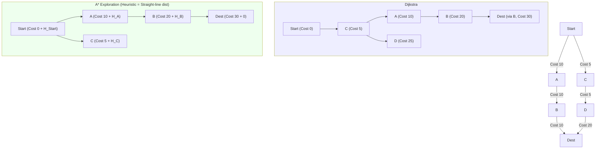
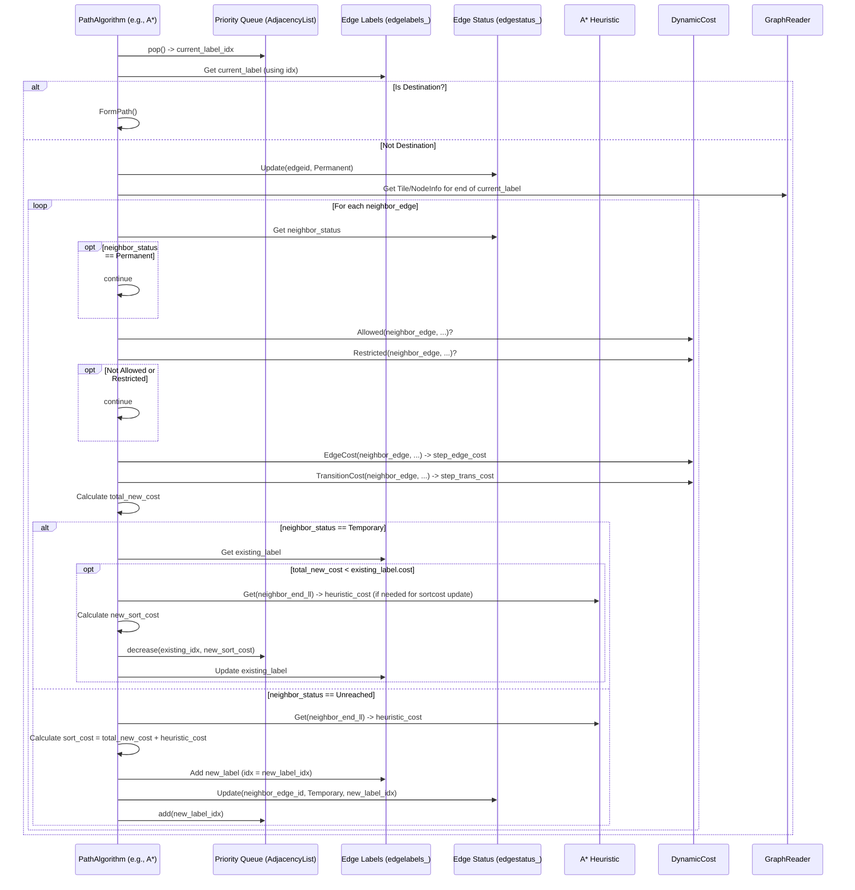

# Chapter 6: PathAlgorithm (Dijkstra/A*) - Finding the Way

In [Chapter 5: DynamicCost (Costing)](05_dynamiccost__costing_.md), we learned how Valhalla uses "costing" rules to determine the time, effort, or preference for traveling along different road segments (`DirectedEdge`) and through intersections (`NodeInfo`). We know how to calculate the cost of a single step.

But routing is about finding the *best sequence* of steps from a start point to an end point. How does Valhalla explore the vast road network ([Chapter 2: GraphTile & GraphReader](02_graphtile___graphreader.md)) and use those costs to piece together the optimal path?

This chapter introduces the core pathfinding strategies Valhalla uses, based on classic algorithms like **Dijkstra's algorithm** and **A\* search**. Think of these as different methods for navigating a huge map to find the best route according to the rules defined by `DynamicCost`.

We'll explore:

*   The challenge of searching a massive road network.
*   How Dijkstra's algorithm explores systematically.
*   How A\* search uses estimates (heuristics) to search faster.
*   How Bidirectional A\* searches from both ends at once.
*   How these algorithms work with `DynamicCost`.

Let's set off on our search!

## The Problem: Exploring a Giant Maze

Imagine the road network is a giant maze or a huge city map with millions of streets and intersections. You're given a starting point and an ending point, along with a rulebook ([Chapter 5: DynamicCost (Costing)](05_dynamiccost__costing_.md)) that tells you the "cost" (like travel time) of moving between any two connected points. Your goal is to find the path through the maze that has the lowest total cost.

Trying every single possible path would take an impossibly long time. We need smarter strategies to explore the map efficiently. Valhalla uses algorithms specifically designed for this kind of "graph search" problem.

## Dijkstra's Algorithm: The Thorough Explorer

Dijkstra's algorithm is like a very careful explorer. Starting from the origin, it explores outwards in all directions, step by step, always prioritizing the paths that currently have the lowest total cost from the start.

**Analogy: Ripples in a Pond**
Imagine dropping a pebble into a pond at your starting location. Dijkstra's algorithm is like the ripples expanding outwards evenly. It finds the closest points first, then the next closest, and so on.

**How it Works (High Level):**

1.  **Start:** Mark the starting point's cost as 0, all others as infinity. Create a list of places to visit (a priority queue), initially containing just the start.
2.  **Explore:** While there are places to visit:
    *   Pick the place in the list with the *lowest known cost* from the start. Let's call this `current_place`.
    *   Remove `current_place` from the list and mark it as "visited" (we've found the best path to it).
    *   If `current_place` is the destination, we're done! We've found the lowest-cost path.
    *   **Look at Neighbors:** For each neighbor connected to `current_place`:
        *   Ask the `DynamicCost` rulebook: What's the cost to travel from `current_place` to this `neighbor`? ([Chapter 5: DynamicCost (Costing)](05_dynamiccost__costing_.md)).
        *   Calculate the total cost to reach the `neighbor` through `current_place` (cost to `current_place` + cost of the step to `neighbor`).
        *   **Update if Better:** If this total cost is lower than the previously known best cost to reach `neighbor`, update the `neighbor`'s cost and record that the best path to it now comes from `current_place`. Add or update the `neighbor` in the list of places to visit.
3.  **Finish:** Once the destination is picked from the list, trace back the path using the recorded "came from" information.

**Pros & Cons:**
*   **Pro:** Guarantees finding the absolute lowest-cost path (shortest, fastest, etc., depending on the `DynamicCost` rules).
*   **Con:** Can be slow because it explores equally in all directions, even those leading away from the destination. It doesn't know where the destination *is*.

## A\* Search: The Smart Explorer

A\* (pronounced "A-star") search is like Dijkstra, but smarter. It uses a "heuristic" – an educated guess or estimate – of the remaining cost from any given point to the destination.

**Analogy: Using a Compass**
Imagine exploring a city map. Dijkstra explores every street radiating outwards. A\* is like using a compass pointing towards the destination. It still explores, but it prioritizes paths that seem to be heading in the right direction. The heuristic is often based on the straight-line distance ("as the crow flies") to the destination, converted into an estimated travel time or cost.

**How it Differs from Dijkstra:**

*   **Priority Queue Cost:** When deciding which place to visit next from the priority queue, A\* considers not just the known cost from the start (`g(n)`), but also the *estimated* cost from that place to the destination (`h(n)`). The priority is `f(n) = g(n) + h(n)`.
*   **Guided Exploration:** By adding the heuristic estimate, A\* tends to explore paths that move closer to the target more eagerly than paths moving away.



*Dijkstra explores based only on cost-so-far. A\* prioritizes nodes that have low cost-so-far *plus* a low estimated cost remaining.*

**Pros & Cons:**
*   **Pro:** Usually much faster than Dijkstra for finding a path between two points, as it explores more directionally.
*   **Con:** The quality of the heuristic matters. If the heuristic is "admissible" (never overestimates the true cost), A\* still guarantees the optimal path. If it sometimes overestimates, A\* might find a slightly suboptimal path quickly (though Valhalla's heuristics are designed to be admissible or close to it).

## Bidirectional A\*: Meet in the Middle

This is another optimization. Instead of just searching forward from the start, Bidirectional A\* also starts a *second* search backwards from the destination.

**Analogy: Two Explorers**
Imagine two people trying to find each other in a large park. Instead of one person searching the whole park, they both start searching from their locations, planning to meet somewhere in the middle. This usually covers less total area than one person searching alone.

**How it Works:**

1.  **Two Searches:** Run an A\* search forward from the origin and *simultaneously* run an A\* search backward from the destination (using reversed edge costs and heuristics pointing towards the origin).
2.  **Meeting Point:** The searches expand until their frontiers meet – that is, when an edge is settled (permanently labeled) by one search that has already been reached (temporarily or permanently labeled) by the other search.
3.  **Finding the Best Connection:** When the searches meet, it doesn't necessarily mean the optimal path has been found *yet*. The algorithm usually needs to continue exploring slightly beyond the first meeting point until the cost of the best connection found is guaranteed to be lower than any other potential paths still in the priority queues.
4.  **Combine Paths:** Once the best meeting point is confirmed, the final path is constructed by combining the forward path to the meeting point and the (reversed) backward path from the meeting point.

**Pros & Cons:**
*   **Pro:** Often significantly faster than unidirectional A\*, especially on large graphs, because the search areas are much smaller.
*   **Con:** More complex to implement. Handling the meeting condition and ensuring optimality requires careful logic. Needs costing rules to work in reverse ([`AllowedReverse()`](05_dynamiccost__costing_.md#dynamiccost-the-rulebook-abstraction), [`TransitionCostReverse()`](05_dynamiccost__costing_.md#dynamiccost-the-rulebook-abstraction)).

Valhalla often uses `thor::BidirectionalAStar` for standard routing requests because of its efficiency. `thor::UnidirectionalAStar` might be used in specific cases or as a fallback.

## The Role of `DynamicCost`

All these algorithms rely heavily on the `DynamicCost` object ([Chapter 5: DynamicCost (Costing)](05_dynamiccost__costing_.md)) chosen for the route (e.g., `AutoCost`, `BicycleCost`). In the core loop described above, whenever the algorithm considers moving from `current_place` to a `neighbor`, it asks the `DynamicCost` object:

1.  `Allowed()`: Is this move even permitted for this travel mode? (e.g., pedestrian on highway?). If no, the neighbor is ignored.
2.  `EdgeCost()`: What's the cost (e.g., time) to traverse the road segment to the neighbor?
3.  `TransitionCost()`: Is there an additional cost for the turn or transition at `current_place` onto the edge leading to `neighbor`?

The sum of `EdgeCost` and `TransitionCost` determines the cost of that *step*, which the algorithm uses to update the total path cost.

## Inside the Algorithm: Data Structures & Loop

Let's peek inside a typical pathfinding algorithm in Valhalla (like `thor::BidirectionalAStar` or `thor::UnidirectionalAStar`). It manages several key pieces of information:

1.  **Priority Queue (`AdjacencyList`):** Stores the potential next steps (edges to explore), ordered by their current lowest known cost (plus heuristic for A\*). Valhalla uses a `DoubleBucketQueue` for efficiency.
2.  **Edge Labels (`edgelabels_`):** A list storing detailed information for each path currently being explored to the end of a specific directed edge. This includes:
    *   The total cost (`cost_`) found so far to reach the end of this edge.
    *   The predecessor edge label index (how we got here).
    *   The `GraphId` ([Chapter 4: GraphId](04_graphid.md)) of the edge.
    *   For A\*, the sort cost (`sortcost_`), which includes the heuristic.
    *   Other path attributes needed for costing or path reconstruction.
3.  **Edge Status (`edgestatus_`):** Keeps track of the state of each directed edge in the graph:
    *   `kUnreached`: Not seen yet.
    *   `kTemporary`: Reached, currently in the priority queue, cost might still improve. Stores the index into `edgelabels_`.
    *   `kPermanent`: Final lowest cost found, removed from the priority queue.
    *   `kSkipped`: (Specific to Bidirectional A*) Temporarily skipped for synchronization.

**Simplified Conceptual Loop (Unidirectional A\*):**

```cpp
// File: thor/unidirectional_astar.cc (Conceptual & Simplified)

// Initialize priority queue, edge labels, edge status...
// Add starting edges to priority queue (adjacencylist_)

std::pair<int32_t, float> best_path_to_dest = {-1, infinity};

while (true) {
  // 1. Get the cheapest edge label from the priority queue
  uint32_t current_label_idx = adjacencylist_.pop();
  if (current_label_idx == kInvalidLabel) { break; /* No path found */ }

  BDEdgeLabel current_label = edgelabels_[current_label_idx];

  // 2. Is it the destination?
  if (current_label.destination()) {
     // Found the path! Reconstruct using predecessors.
     return FormPath(current_label_idx);
  }

  // 3. Mark edge as permanently visited (if not an origin edge)
  if (!current_label.origin()) {
    edgestatus_.Update(current_label.edgeid(), EdgeSet::kPermanent);
  }

  // Check for convergence issues, hierarchy limits, etc. (skipped)

  // 4. Expand neighbors
  GraphId end_node_id = current_label.endnode();
  graph_tile_ptr tile = graphreader.GetGraphTile(end_node_id);
  if (!tile) continue;
  const NodeInfo* end_nodeinfo = tile->node(end_node_id);

  // Iterate through each edge starting from end_nodeinfo
  for (/* each neighbor_edge connected to end_nodeinfo */) {
    GraphId neighbor_edge_id = /* ... */;
    const DirectedEdge* neighbor_edge = /* ... */;
    EdgeStatusInfo* neighbor_status = edgestatus_.GetPtr(neighbor_edge_id, tile);

    // 5. Check if already permanently visited
    if (neighbor_status->set() == EdgeSet::kPermanent) {
      continue;
    }

    // 6. Ask DynamicCost: Allowed? Restricted?
    uint8_t restriction_idx = kInvalidRestriction;
    if (!costing_->Allowed(neighbor_edge, /*...is_dest...*/, current_label, tile, neighbor_edge_id, /*...*/) ||
        costing_->Restricted(neighbor_edge, current_label, /*...*/)) {
      continue;
    }

    // 7. Ask DynamicCost: Calculate step cost
    Cost step_edge_cost = costing_->EdgeCost(neighbor_edge, tile, /*...*/);
    Cost step_transition_cost = costing_->TransitionCost(neighbor_edge, end_nodeinfo, current_label, tile, /*...*/);
    Cost step_cost = step_edge_cost + step_transition_cost;

    // 8. Calculate total cost to reach neighbor
    Cost total_new_cost = current_label.cost() + step_cost;

    // Handle destination edges slightly differently (skipped for simplicity)

    // 9. Check if this path is better than a previously found temporary path
    if (neighbor_status->set() == EdgeSet::kTemporary) {
      BDEdgeLabel& existing_label = edgelabels_[neighbor_status->index()];
      if (total_new_cost.cost < existing_label.cost().cost) {
        // Better path found! Update the existing label and its priority in the queue
        float new_sort_cost = existing_label.sortcost() - (existing_label.cost().cost - total_new_cost.cost);
        adjacencylist_.decrease(neighbor_status->index(), new_sort_cost);
        existing_label.Update(current_label_idx, total_new_cost, new_sort_cost, /*...*/);
      }
      continue; // Already in the queue
    }

    // 10. Calculate sort cost (A* heuristic)
    float dist_to_dest_estimate = 0.0f;
    // Get Lat/Lon of the neighbor's end node...
    PointLL neighbor_end_ll = /* ... */;
    // Ask heuristic for estimated cost from neighbor's end node to destination
    float heuristic_cost = astarheuristic_.Get(neighbor_end_ll, dist_to_dest_estimate);
    float sort_cost = total_new_cost.cost + heuristic_cost;

    // 11. Add new edge label for the neighbor
    uint32_t new_label_idx = edgelabels_.size();
    edgelabels_.emplace_back(current_label_idx, neighbor_edge_id, /*...*/,
                             total_new_cost, sort_cost, dist_to_dest_estimate, /*...*/);
    *neighbor_status = {EdgeSet::kTemporary, new_label_idx};

    // 12. Add to priority queue
    adjacencylist_.add(new_label_idx);
  } // End loop through neighbors
} // End while loop
```

This simplified loop shows the core logic: get the best candidate, check if it's the goal, expand its neighbors by calculating costs with `DynamicCost`, update paths if they are better, and add new candidates to the priority queue using A\*'s heuristic (`sort_cost`).

The Bidirectional A\* implementation (`thor/bidirectional_astar.cc`) follows a similar pattern but manages two sets of labels/statuses/queues (forward and reverse) and includes logic for detecting and evaluating connections between the two searches.

Here's a diagram showing the interactions:



## Conclusion

Pathfinding algorithms like Dijkstra's, A\*, and Bidirectional A\* are the engines that drive Valhalla's routing. They systematically explore the vast road network graph, guided by the rules and costs provided by the `DynamicCost` object ([Chapter 5: DynamicCost (Costing)](05_dynamiccost__costing_.md)).

*   **Dijkstra** guarantees the optimal path by exploring evenly outwards.
*   **A\*** uses heuristics (estimates to the destination) to explore more efficiently, often finding the optimal path much faster.
*   **Bidirectional A\*** further speeds things up by searching from both start and end simultaneously.

These algorithms rely on data structures like priority queues, edge labels, and status maps to manage the search process effectively.

But even with A\* and Bidirectional search, exploring large road networks can be time-consuming. Can we make it even faster, especially for long routes? Yes, by using map hierarchies! We'll see how Valhalla uses different levels of map detail in the next chapter.

**Next Up:** [Chapter 7: TileHierarchy](07_tilehierarchy.md)

---

Generated by [AI Codebase Knowledge Builder](https://github.com/The-Pocket/Tutorial-Codebase-Knowledge)