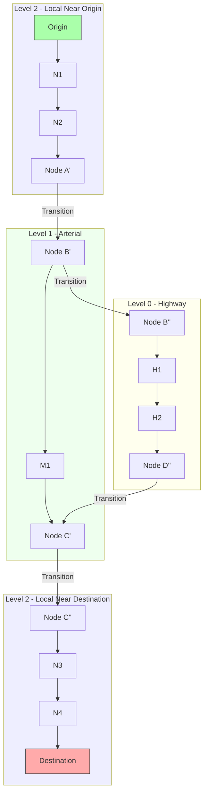
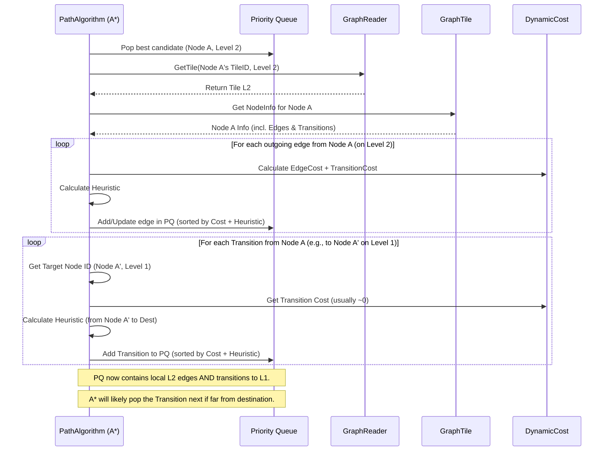

# Chapter 7: TileHierarchy

In [Chapter 6: PathAlgorithm (Dijkstra/A*)](06_pathalgorithm__dijkstra_a__.md), we saw how algorithms like A* explore the road network graph to find the best route according to the rules set by `DynamicCost` ([Chapter 5: DynamicCost (Costing)](05_dynamiccost__costing_.md)). While A* is smart, searching through a map with millions of tiny residential streets for a cross-country trip can still be incredibly slow.

Imagine planning a road trip from Los Angeles to New York. Would you start by looking at every single side street in downtown LA? Probably not! You'd likely look at a highway map first to find the main interstates, only zooming into city details when you're near your start or end points.

Valhalla uses a similar strategy with `TileHierarchy`. This chapter explains how Valhalla organizes map data into different "zoom levels" to make finding long-distance routes much, much faster.

We'll explore:

*   What the `TileHierarchy` is and its different levels.
*   How these levels are like zoom levels on a map.
*   How routing algorithms use the hierarchy to speed up searches dramatically.

## The Problem: Finding Long Routes Quickly

Routing algorithms explore the graph by expanding outwards from the start point, checking neighboring road segments ([Chapter 3: DirectedEdge & NodeInfo](03_directededge___nodeinfo.md)). If the graph includes every single road, including tiny local streets, finding a path across a large country means exploring millions, even billions, of potential steps. This takes too long.

We need a way to quickly find the "main roads" for the bulk of the journey and only worry about the local details near the start and finish.

## What is `TileHierarchy`? Maps at Different Zoom Levels

`TileHierarchy` is Valhalla's way of organizing the map data into different layers, each representing a different level of detail, much like the zoom levels you see on web maps (like Google Maps or OpenStreetMap).

Valhalla typically uses three main levels for road routing, plus one for transit:

1.  **Level 0 (Highway):**
    *   **Detail:** Contains only the most important roads – major highways, interstates, motorways (like `RoadClass::kMotorway`, `kTrunk`).
    *   **Coverage:** Each map tile ([Chapter 2: GraphTile & GraphReader](02_graphtile___graphreader.md)) at this level covers a very large geographic area.
    *   **Analogy:** A national highway map.

2.  **Level 1 (Arterial):**
    *   **Detail:** Includes roads from Level 0, plus other major roads like primary and secondary highways (`RoadClass::kPrimary`, `kSecondary`).
    *   **Coverage:** Tiles cover medium-sized areas.
    *   **Analogy:** A state or regional road map.

3.  **Level 2 (Local):**
    *   **Detail:** Includes roads from Levels 0 and 1, plus all other roads, including tertiary, residential, and service roads (`RoadClass::kTertiary`, `kResidential`, `kServiceOther`, etc.). This is the most detailed level.
    *   **Coverage:** Tiles cover relatively small areas.
    *   **Analogy:** A detailed city map.

4.  **Level 3 (Transit):**
    *   **Detail:** Contains information specific to public transportation, like transit routes, stops, and connections. It also includes pedestrian paths needed to access transit.
    *   **Coverage:** Similar tile size to Level 2.
    *   **Analogy:** A public transport network map.

Each level has its own set of `GraphTile`s ([Chapter 2: GraphTile & GraphReader](02_graphtile___graphreader.md)). A `GraphId` ([Chapter 4: GraphId](04_graphid.md)) tells us which level an element belongs to via its `level()` component.

```cpp
// Recap: Creating a GraphId with a level
uint32_t tile_id = 12345;
uint32_t level = 0; // This node is on the Highway level
uint32_t id_in_tile = 50;

valhalla::baldr::GraphId highway_node_address(tile_id, level, id_in_tile);

std::cout << "Node Level: " << highway_node_address.level(); // Output: 0
```

This hierarchical structure is key to optimizing route searches.

## How Hierarchy Speeds Up Routing: The Multi-Level Strategy

Instead of searching only on the most detailed map (Level 2), Valhalla's routing algorithms (like Bidirectional A*) use the hierarchy to take shortcuts:

1.  **Start Local:** Begin the search near the origin point on the most detailed level (Level 2). Explore the local streets immediately around the start.
2.  **Go Up!:** As the search expands, look for special connections called **transitions** that link nodes on the current level to corresponding nodes on the level *above* (e.g., from Level 2 to Level 1, or Level 1 to Level 0). Prioritize moving *up* the hierarchy.
3.  **Route on Higher Levels:** Once on a higher level (like Level 0 - Highways), the graph is much simpler (fewer roads, longer segments). The algorithm can cover vast distances very quickly by only considering these major roads.
4.  **Go Down!:** As the search on the higher levels gets closer to the destination (based on the A* heuristic), look for transitions that lead *down* the hierarchy (e.g., from Level 0 to Level 1, or Level 1 to Level 2).
5.  **Finish Local:** Once back on the detailed Level 2 near the destination, the algorithm explores the local streets to find the precise path to the endpoint.

**Analogy Revisited (LA to NY):**

*   Start exploring local streets in LA (Level 2).
*   Quickly find an on-ramp to a major highway (Transition up to Level 1/0).
*   Follow interstates across the country (Route on Level 0).
*   Take an exit ramp near New York (Transition down to Level 1/2).
*   Navigate local streets in NY to the final address (Finish on Level 2).

This avoids examining every single street in Nevada, Colorado, Kansas, etc., making the search dramatically faster.



*Simplified view: Search starts at Origin (L2), transitions up to L1, then L0. Travels on L0 (H1, H2), transitions down to L1, then back to L2 near the Destination.*

## Internal Implementation: Defining and Using the Hierarchy

**1. Defining Levels (`baldr/tilehierarchy.cc`)**

The hierarchy structure itself is defined statically in the code. It specifies the level number, the minimum road importance required for that level, a name, and the geographic tiling parameters (like tile size).

```cpp
// Simplified structure definition from baldr/tilehierarchy.h
struct TileLevel {
  uint8_t level;       // Level identifier (0, 1, 2, 3)
  RoadClass importance; // Minimum RoadClass needed to be included
  std::string name;    // Name ("highway", "arterial", "local", "transit")
  midgard::Tiles<midgard::PointLL> tiles; // Defines tile grid for this level
};

// Simplified definitions from baldr/tilehierarchy.cc
const std::vector<TileLevel>& TileHierarchy::levels() {
  static const std::vector<TileLevel> levels_ = {
      // Level 0: Highways only, 4-degree tiles
      TileLevel{0, RoadClass::kPrimary, "highway", /* Tiling info... */},
      // Level 1: Arterials and up, 1-degree tiles
      TileLevel{1, RoadClass::kTertiary, "arterial", /* Tiling info... */},
      // Level 2: All roads, 0.25-degree tiles
      TileLevel{2, RoadClass::kServiceOther, "local", /* Tiling info... */},
  };
  return levels_;
}

const TileLevel& TileHierarchy::GetTransitLevel() {
  // Level 3: Transit, 0.25-degree tiles
  static const TileLevel transit_level_ =
      {3, RoadClass::kServiceOther, "transit", /* Tiling info... */};
  return transit_level_;
}
```

This setup tells Valhalla how the world is divided into tiles at each level of detail.

**2. Building the Hierarchy (`mjolnir/hierarchybuilder.cc`)**

The actual hierarchy data (the `GraphTile`s for levels 0 and 1, and the transitions between levels) is created offline by the `mjolnir` component *before* Valhalla serves routing requests.

The process works roughly like this:

*   **Start with Full Detail:** Begin with the complete map data (which will become Level 2).
*   **Select for Level 1:** Iterate through all roads in Level 2. If a road is important enough (e.g., `RoadClass::kPrimary` or higher, matching Level 1's `importance`), mark its nodes and segments for inclusion in Level 1.
*   **Create Level 1 Tiles:** Generate new `GraphTile`s for Level 1, containing only the selected nodes and edges. The geometry and attributes are copied from Level 2.
*   **Create Level 0:** Repeat the process, selecting only the most important roads (e.g., `RoadClass::kMotorway`, `kTrunk`) from Level 1 (or 2) to create Level 0 tiles.
*   **Add Transitions:** This is crucial! When a node exists on multiple levels (e.g., an intersection is present on Level 2, Level 1, and Level 0 because important roads meet there), create special `NodeTransition` records. These records link the `GraphId` of the node on one level to the `GraphId` of the corresponding node on an adjacent level.

```cpp
// Conceptual logic inside hierarchy builder

// When processing Node X from Level 2 data:
NodeInfo base_node_info = /* get Node X info from Level 2 tile */;
GraphId base_node_id = /* Node X's ID on Level 2 */;

GraphId highway_node_id, arterial_node_id, local_node_id;
bool exists_on_level[3] = {false, false, false};

// Check connected edges to see which levels Node X should exist on
for (/* each edge connected to Node X */) {
    RoadClass edge_class = /* get edge's class */;
    if (edge_class <= HighwayImportance) { exists_on_level[0] = true; }
    if (edge_class <= ArterialImportance) { exists_on_level[1] = true; }
    if (edge_class <= LocalImportance) { exists_on_level[2] = true; }
}

// If node exists on Level 0, create/get its ID on Level 0 tile
if (exists_on_level[0]) {
    highway_node_id = /* assign a new GraphId for Node X on Level 0 */;
    // Store mapping: highway_node_id <-> base_node_id
}
// If node exists on Level 1, create/get its ID on Level 1 tile
if (exists_on_level[1]) {
    arterial_node_id = /* assign a new GraphId for Node X on Level 1 */;
    // Store mapping: arterial_node_id <-> base_node_id
}
// If node exists on Level 2, create/get its ID on Level 2 tile
if (exists_on_level[2]) {
    local_node_id = /* assign a new GraphId for Node X on Level 2 */;
    // Store mapping: local_node_id <-> base_node_id
}

// Later, when writing Level 1 tile containing arterial_node_id:
NodeInfoBuilder level1_node_builder = /* ... based on base_node_info ... */;
// Add transitions based on stored mappings
if (highway_node_id.Is_Valid()) { level1_node_builder.AddUpTransition(highway_node_id); }
if (local_node_id.Is_Valid()) { level1_node_builder.AddDownTransition(local_node_id); }
```

This offline process ensures that the `GraphTile`s contain the necessary links for the routing algorithm to jump between levels.

**3. Using Hierarchy in Routing (`thor/bidirectional_astar.cc`)**

The pathfinding algorithms ([Chapter 6: PathAlgorithm (Dijkstra/A*)](06_pathalgorithm__dijkstra_a__.md)) incorporate the hierarchy during exploration.

*   **Checking Transitions:** When the algorithm explores the outgoing edges from a node ([Chapter 3: DirectedEdge & NodeInfo](03_directededge___nodeinfo.md)), it *also* checks if that `NodeInfo` has any `NodeTransition` records.
*   **Adding Transitions to Queue:** If transitions exist (linking to nodes on higher or lower levels), these transitions are treated like potential next steps. They are added to the algorithm's priority queue along with the regular outgoing road edges. The cost of a transition is usually very small or zero.
*   **Heuristic Guidance:** The A* heuristic (estimated cost to destination) naturally encourages the algorithm to take upward transitions when far from the destination (as higher-level paths appear shorter/faster) and downward transitions when closer.



By considering transitions alongside regular edges, the algorithm can seamlessly move between hierarchy levels to find the most efficient path.

## Conclusion

The `TileHierarchy` is a crucial optimization in Valhalla, allowing it to find long-distance routes efficiently without getting bogged down in excessive local detail.

*   It organizes map data into **levels** (Highway, Arterial, Local, Transit) with varying detail.
*   Routing algorithms start locally, **transition up** to sparser higher levels for long distances, and **transition back down** near the destination.
*   This strategy dramatically **reduces the search space** and speeds up queries significantly.
*   Special **transition links** between nodes on adjacent levels enable this multi-level routing.

Now that we understand how the map data is structured and searched, how does Valhalla manage the overall routing process? How does it coordinate the initial location snapping ([Chapter 1: Location & PathLocation](01_location___pathlocation.md)), the pathfinding ([Chapter 6: PathAlgorithm (Dijkstra/A*)](06_pathalgorithm__dijkstra_a__.md)), and the final generation of directions? Let's look at the high-level orchestration using Actors and Workers.

**Next Up:** [Chapter 8: Actor & Workers (Loki, Thor, Odin)](08_actor___workers__loki__thor__odin_.md)

---

Generated by [AI Codebase Knowledge Builder](https://github.com/The-Pocket/Tutorial-Codebase-Knowledge)