# Chapter 8: Actor & Workers (Loki, Thor, Odin)

In [Chapter 7: TileHierarchy](07_tilehierarchy.md), we saw how Valhalla uses map hierarchies (like zoom levels) to speed up finding long-distance routes. We know Valhalla has map data ([Chapter 2: GraphTile & GraphReader](02_graphtile___graphreader.md)), ways to represent roads ([Chapter 3: DirectedEdge & NodeInfo](03_directededge___nodeinfo.md)), costing rules ([Chapter 5: DynamicCost (Costing)](05_dynamiccost__costing_.md)), and pathfinding algorithms ([Chapter 6: PathAlgorithm (Dijkstra/A*)](06_pathalgorithm__dijkstra_a__.md)).

But how does Valhalla coordinate all these pieces when you actually ask for a route? Who manages the process from receiving your request to sending back the final directions?

This chapter introduces the high-level orchestrator: the `Actor`, and its specialized helpers: the `Loki`, `Thor`, and `Odin` workers. Think of Valhalla not just as a single program, but as a well-organized service department.

We'll explore:

*   The role of the `Actor` as the main coordinator.
*   The specific tasks of the `Loki`, `Thor`, and `Odin` workers.
*   How they work together to handle a routing request.

## The Problem: Managing the Routing Workflow

Getting driving directions involves several steps:

1.  Understanding the user's request (start point, end point, travel mode).
2.  Finding the exact points on the road network corresponding to the start and end addresses/coordinates ([Chapter 1: Location & PathLocation](01_location___pathlocation.md)).
3.  Searching the road graph to find the best path based on costing rules ([Chapter 6: PathAlgorithm (Dijkstra/A*)](06_pathalgorithm__dijkstra_a__.md)).
4.  Generating human-readable, turn-by-turn instructions for the found path.
5.  Formatting the final response.

Doing all this in one giant function would be complex and hard to manage. Valhalla breaks down these tasks and assigns them to specialized components.

## The Service Department Analogy

Imagine you walk into a large service department to get custom travel directions planned:

1.  **`Actor` (Service Counter):** You go to the main service counter (`Actor`). You give them your request (e.g., "I want to drive from address A to address B, avoiding tolls"). The `Actor` understands your request, validates it, and knows which specialized departments need to be involved.
2.  **`Loki` (Map Lookup Desk):** The `Actor` first sends your addresses/coordinates to the `Loki` desk. `Loki` looks up these locations on their detailed maps and figures out the precise starting and ending points on the actual road network, considering things like one-way streets or which side of the road you're on. `Loki` sends these precise road points back to the `Actor`.
3.  **`Thor` (Route Planning Department):** The `Actor` takes the precise road points from `Loki` and sends them, along with your travel preferences (driving, avoiding tolls), to the `Thor` department. `Thor` has access to all the maps ([Chapter 2: GraphTile & GraphReader](02_graphtile___graphreader.md)) and rulebooks ([Chapter 5: DynamicCost (Costing)](05_dynamiccost__costing_.md)). Using powerful algorithms ([Chapter 6: PathAlgorithm (Dijkstra/A*)](06_pathalgorithm__dijkstra_a__.md)) and map hierarchies ([Chapter 7: TileHierarchy](07_tilehierarchy.md)), `Thor` calculates the best path, figuring out the sequence of roads to take. `Thor` sends this computed path (as a sequence of road segments/nodes) back to the `Actor`.
4.  **`Odin` (Directions Writing Desk):** The `Actor` receives the computed path from `Thor` and sends it to the `Odin` desk. `Odin` takes the raw path data and translates it into clear, turn-by-turn narrative instructions (e.g., "Turn left onto Main Street", "Continue straight for 5 miles"). We'll learn more about how Odin does this in [Chapter 9: DirectionsBuilder (Odin)](09_directionsbuilder__odin_.md). `Odin` sends the formatted directions back to the `Actor`.
5.  **`Actor` (Response):** Finally, the `Actor` gathers the results (like the path shape, total time/distance from `Thor`, and narrative directions from `Odin`) and formats them into the final response to send back to you.

This division of labor makes the whole process organized and efficient.

## The `Actor` (`tyr::actor_t`)

The `Actor` is the main entry point for external requests. In a typical Valhalla server setup, the web server (like Nginx) passes incoming HTTP requests (like `/route` or `/isochrone`) to the Valhalla service, which delegates them to an `Actor` instance.

The `Actor`'s job includes:

*   **Parsing:** Understanding the incoming request (often JSON).
*   **Validation:** Checking if the request is valid and contains all necessary information.
*   **Coordination:** Calling the appropriate workers (`Loki`, `Thor`, `Odin`) in the correct order.
*   **Data Flow:** Passing data between the workers (e.g., `Loki`'s output goes to `Thor`, `Thor`'s output goes to `Odin`).
*   **Serialization:** Formatting the final result into the desired output format (JSON, PBF, etc.).

```cpp
// Simplified conceptual view of the Actor's main methods
// File: tyr/actor.cc

class actor_t {
public:
  // Constructor needs configuration
  actor_t(const boost::property_tree::ptree& config, /*...*/);

  // Handles a /route request
  std::string route(const std::string& request_str, /*...*/);

  // Handles a /locate request (only needs Loki)
  std::string locate(const std::string& request_str, /*...*/);

  // Handles a /sources_to_targets (matrix) request
  std::string matrix(const std::string& request_str, /*...*/);

  // Handles an /isochrone request
  std::string isochrone(const std::string& request_str, /*...*/);

  // Handles a /trace_route (map matching) request
  std::string trace_route(const std::string& request_str, /*...*/);

  // ... other methods for other endpoints ...

private:
  // Structure holding pointers to the workers
  struct pimpl_t {
    std::shared_ptr<baldr::GraphReader> reader;
    loki::loki_worker_t loki_worker;
    thor::thor_worker_t thor_worker;
    odin::odin_worker_t odin_worker;
    // ... constructor initializes workers ...
  };
  std::unique_ptr<pimpl_t> pimpl;
  // ... other members ...
};
```

The `Actor` itself doesn't perform the heavy lifting; it delegates to the workers it contains.

## The Workers

### Loki (`loki::loki_worker_t`)

*   **Role:** Location correlation and preparation.
*   **Analogy:** Map Lookup Desk.
*   **Input:** User-provided locations (`Location` objects from the request).
*   **Task:** Uses `loki::Search` ([Chapter 1: Location & PathLocation](01_location___pathlocation.md)) to find corresponding points (`PathLocation` with `PathEdge`s) on the graph edges. It uses the `GraphReader` ([Chapter 2: GraphTile & GraphReader](02_graphtile___graphreader.md)) to access map data and the `DynamicCost` ([Chapter 5: DynamicCost (Costing)](05_dynamiccost__costing_.md)) model to filter candidate edges based on travel mode. It also handles parsing location-specific options and applying penalties like `avoid_locations`.
*   **Output:** The original request object, updated with detailed correlation results (`PathLocation`) for each input location. For some requests like `/locate`, Loki's output is the final result.

```cpp
// Simplified Loki worker structure
// File: loki/worker.h (Conceptual)

class loki_worker_t {
public:
  // Constructor needs config and GraphReader
  loki_worker_t(const boost::property_tree::ptree& config,
                const std::shared_ptr<baldr::GraphReader>& graph_reader);

  // Method called by Actor for a /route request
  void route(Api& request); // Modifies request with correlation results

  // Method called by Actor for a /locate request
  std::string locate(Api& request); // Returns JSON result directly

  // ... methods for isochrone, matrix, trace preparation ...

private:
  std::shared_ptr<baldr::GraphReader> reader;
  sif::CostFactory factory; // To create costing models
  sif::cost_ptr_t costing;  // Current costing model
  // ... configuration parameters (max radius, etc.) ...
};

// Simplified Loki's route preparation logic
// File: loki/worker.cc (Conceptual)
void loki_worker_t::route(Api& request) {
  // Parse locations from request, set defaults (radius, etc.)
  parse_locations(request.mutable_options()->mutable_locations(), request, /*...*/);

  // Create the appropriate costing model (e.g., AutoCost, BicycleCost)
  parse_costing(request, /* allow_none= */ false);

  // Perform the search/correlation
  auto locations = PathLocation::fromPBF(request.options().locations());
  auto results = loki::Search(locations, *reader, costing);

  // Update the request's locations with the correlation results (PathEdges)
  PathLocation::toPBF(&request.mutable_options()->mutable_locations(), results);

  // Process avoid_locations/polygons
  // ...
}
```

### Thor (`thor::thor_worker_t`)

*   **Role:** Path computation.
*   **Analogy:** Route Planning Department.
*   **Input:** Request object containing correlated locations (from Loki) and costing options.
*   **Task:** Uses pathfinding algorithms like Bidirectional A* ([Chapter 6: PathAlgorithm (Dijkstra/A*)](06_pathalgorithm__dijkstra_a__.md)) to search the graph, leveraging the `TileHierarchy` ([Chapter 7: TileHierarchy](07_tilehierarchy.md)) for efficiency. It constantly queries the `DynamicCost` ([Chapter 5: DynamicCost (Costing)](05_dynamiccost__costing_.md)) model to determine the cost of each step. It finds the lowest-cost path connecting the locations. Handles other complex tasks like matrix routing, isochrones, and optimized routes (Traveling Salesperson Problem).
*   **Output:** The request object, updated with the computed path information (sequence of edges/nodes, summary like total time/distance) stored within the `trip` field.

```cpp
// Simplified Thor worker structure
// File: thor/worker.h (Conceptual)

class thor_worker_t {
public:
  // Constructor needs config and GraphReader
  thor_worker_t(const boost::property_tree::ptree& config,
               const std::shared_ptr<baldr::GraphReader>& graph_reader);

  // Method called by Actor for a /route request
  void route(Api& request); // Modifies request with computed path (TripLegs)

  // Method called by Actor for a /sources_to_targets (matrix) request
  std::string matrix(Api& request); // Returns JSON/PBF matrix result

  // Method called by Actor for an /isochrone request
  std::string isochrones(Api& request); // Returns GeoJSON isochrone result

  // ... methods for optimized_route, trace_route, etc. ...

private:
  std::shared_ptr<baldr::GraphReader> reader;
  sif::CostFactory factory;    // To create costing models
  // Algorithm instances (pre-configured)
  BidirectionalAStar bidir_astar;
  UnidirectionalAStar timedep_forward;
  TimeDistanceMatrix time_distance_matrix_;
  Isochrone iso_generator;
  // ... other algorithm instances ...
};

// Simplified Thor's route computation logic
// File: thor/worker.cc (Conceptual)
void thor_worker_t::route(Api& request) {
  // Create costing model(s) based on request options
  auto costing_str = parse_costing(request);
  auto costing = mode_costing.GetPrimaryCosting();

  // Adjust location scores (used by algorithms)
  adjust_scores(*request.mutable_options());

  // Select and run the appropriate pathfinding algorithm
  // (e.g., bidir_astar, timedep_forward, multi_modal_astar)
  std::vector<PathResult> pathresults;
  if (/* time dependent? */) {
    // pathresults = timedep_forward.GetBestPath(...);
  } else {
    pathresults = bidir_astar.GetBestPath(request.options().locations(), reader.get(),
                                         mode_costing, request.options());
  }

  // Convert PathResult into TripLegs and add to request.trip
  for (const auto& path : pathresults) {
      ConvertToTripLeg(request.mutable_trip(), path, request.options(), reader.get());
  }
}
```

### Odin (`odin::odin_worker_t`)

*   **Role:** Narrative directions generation.
*   **Analogy:** Directions Writing Desk.
*   **Input:** Request object containing the computed path (`trip` field from Thor).
*   **Task:** Uses `odin::DirectionsBuilder` ([Chapter 9: DirectionsBuilder (Odin)](09_directionsbuilder__odin_.md)) to iterate through the path's nodes and edges. It analyzes the geometry, road names, classifications, and turn types to generate human-readable instructions and associated cues (like sign text). It considers language and unit preferences from the request.
*   **Output:** A formatted string (usually JSON) containing the narrative directions and other trip summary information, ready to be sent back to the user.

```cpp
// Simplified Odin worker structure
// File: odin/worker.h (Conceptual)

class odin_worker_t {
public:
  // Constructor needs config
  odin_worker_t(const boost::property_tree::ptree& config);

  // Method called by Actor for requests needing directions
  std::string narrate(Api& request) const; // Returns serialized directions (JSON/PBF)

private:
  MarkupFormatter markup_formatter_; // Handles text formatting (e.g., for signs)
};

// Simplified Odin's narration logic
// File: odin/worker.cc (Conceptual)
std::string odin_worker_t::narrate(Api& request) const {
  // Build the directions structure within the request object
  try {
    odin::DirectionsBuilder().Build(request, markup_formatter_);
  } catch (...) {
    // Handle errors...
  }

  // Serialize the directions part of the request object into the final output format
  return tyr::serializeDirections(request);
}
```

## How They Work Together: A `/route` Request

Let's trace the flow for a standard `/route` request:

1.  **User Request:** `POST /route` with JSON body: `{"locations": [{"lat": 40.1, "lon": -75.1}, {"lat": 40.2, "lon": -75.2}], "costing": "auto"}`
2.  **Actor (`actor_t::route`):**
    *   Parses the JSON request into an `Api` object.
    *   Calls `pimpl->loki_worker.route(api)`.
3.  **Loki (`loki_worker_t::route`):**
    *   Creates an `AutoCost` object.
    *   Calls `loki::Search` to find `PathEdge` candidates for the two input coordinates.
    *   Updates the `locations` within the `Api` object with these `PathEdge`s.
    *   Returns control to the Actor.
4.  **Actor (`actor_t::route`):**
    *   Calls `pimpl->thor_worker.route(api)`.
5.  **Thor (`thor_worker_t::route`):**
    *   Creates costing models (again, based on `Api` options).
    *   Selects `bidir_astar` (since it's a standard `auto` route).
    *   Calls `bidir_astar.GetBestPath(...)` using the correlated locations from Loki, the `GraphReader`, and the costing model.
    *   The algorithm explores the graph using hierarchy and costing rules.
    *   Converts the resulting path into `TripLeg` data (nodes, edges, shape) and adds it to `api.trip`.
    *   Returns control to the Actor.
6.  **Actor (`actor_t::route`):**
    *   Calls `pimpl->odin_worker.narrate(api)`.
7.  **Odin (`odin_worker_t::narrate`):**
    *   Uses `DirectionsBuilder` to process the `api.trip` data.
    *   Generates maneuvers, instructions, summary, etc., and populates `api.trip.legs[...].maneuvers`.
    *   Calls `tyr::serializeDirections(api)` to create the final JSON output string containing the trip and directions.
    *   Returns the JSON string to the Actor.
8.  **Actor (`actor_t::route`):**
    *   Returns the final JSON string to the calling service/user.

```mermaid
sequenceDiagram
    participant User
    participant "Actor"
    participant Loki as "Map Lookup"
    participant Thor as "Route Planner"
    participant Odin as "Directions Writer"   %% ← **Press Enter here**

    User->>"Actor": /route request (JSON with coords, costing)
    "Actor"->>"Actor": Parse JSON into Api object
    "Actor"->>Loki: route(Api)
    Loki->>Loki: Create Costing (e.g., AutoCost)
    Loki->>Loki: Search graph near coords (loki::Search)
    Loki->>Loki: Find PathEdges for locations
    Loki-->>"Actor": Return Api object with correlations
    "Actor"->>Thor: route(Api)
    Thor->>Thor: Create Costing
    Thor->>Thor: Run Path Algorithm (e.g., A*)
    Note over Thor: Uses GraphReader, Costing, Hierarchy
    Thor->>Thor: Find best path
    Thor->>Thor: Populate Api.trip with path shape/nodes
    Thor-->>"Actor": Return Api object with path
    "Actor"->>Odin: narrate(Api)
    Odin->>Odin: Build Directions (DirectionsBuilder)
    Odin->>Odin: Generate maneuvers & instructions
    Odin->>Odin: Serialize directions to JSON
    Odin-->>"Actor": Return final JSON string
    "Actor"-->>User: Return JSON response

```



## Implementation Notes: Service Architecture

While you can use the `Actor` directly in a single C++ program, Valhalla is often run as a set of cooperating services (typically using `prime_server`, Valhalla's lightweight service framework).

*   **Workers as Services:** `Loki`, `Thor`, and `Odin` often run as separate processes or groups of processes.
*   **Message Passing:** They communicate using a message queue system like ZeroMQ (ZMQ). The `Actor` might not exist as a single persistent entity in this setup; instead, a proxy or the `Loki` worker might handle the initial request parsing and coordination, sending messages to `Thor`, which then sends messages to `Odin`. The final response is aggregated and sent back.
*   **Scalability:** This microservice architecture allows scaling each part independently. If pathfinding (`Thor`) is the bottleneck, you can run more `Thor` worker processes.

However, the *conceptual* flow remains the same: Location Lookup -> Path Computation -> Directions Generation. The `Actor` class (`tyr/actor.cc`) provides a convenient way to access this entire workflow within a single process, often used for bindings (like Python) or testing.

```python
# Example using Python bindings (simplified)
# File: bindings/python/actor.py

from valhalla import Actor

# Load configuration (points to tile data, etc.)
config = { ... }

# Create an Actor instance
actor = Actor(config)

# Prepare a route request
request = {
  "locations": [{"lat": 40.1, "lon": -75.1}, {"lat": 40.2, "lon": -75.2}],
  "costing": "auto",
  "id": "my_route_request"
}

try:
  # Call the actor's route method
  # This internally calls Loki -> Thor -> Odin
  response_json = actor.route(request)

  # Process the JSON response
  print(response_json)

except Exception as e:
  print(f"Error: {e}")

# Optional: actor.cleanup() if auto_cleanup=False
```
This Python code hides the internal worker communication, providing a simple interface that mirrors the conceptual flow.

## Conclusion

The `Actor`, `Loki`, `Thor`, and `Odin` provide a structured way to manage the complex workflow of generating routes in Valhalla.

*   The **Actor** is the main entry point and coordinator.
*   **Loki** handles matching user input locations to the road network.
*   **Thor** performs the heavy lifting of finding the best path using graph algorithms and costing.
*   **Odin** translates the computed path into human-readable turn-by-turn directions.

This separation of concerns makes the system modular and easier to manage. Think of them as the specialized departments in Valhalla's routing service.

Now that we understand the overall flow and know that `Odin` is responsible for generating the narrative, how does it actually do that? Let's dive deeper into the `DirectionsBuilder` in the next chapter.

**Next Up:** [Chapter 9: DirectionsBuilder (Odin)](09_directionsbuilder__odin_.md)

---

Generated by [AI Codebase Knowledge Builder](https://github.com/The-Pocket/Tutorial-Codebase-Knowledge)