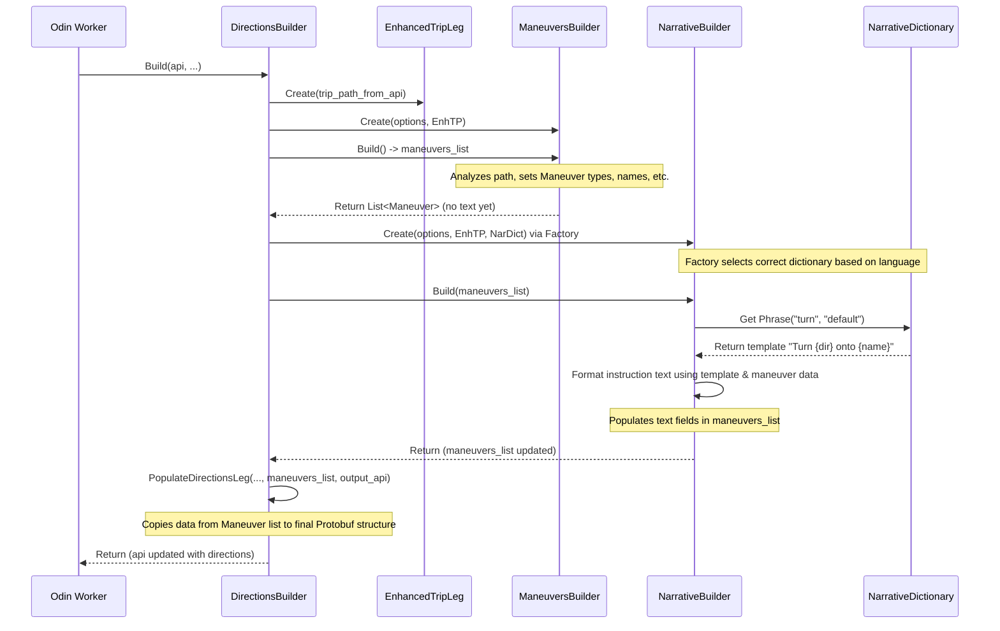

# Chapter 9: DirectionsBuilder (Odin)

Welcome back! In [Chapter 8: Actor & Workers (Loki, Thor, Odin)](08_actor___workers__loki__thor__odin_.md), we saw how Valhalla orchestrates the routing process using the `Actor` and specialized workers like `Loki` (location finding), `Thor` (pathfinding), and `Odin` (directions). We learned that `Thor` calculates the best path as a sequence of connected road segments ([Chapter 3: DirectedEdge & NodeInfo](03_directededge___nodeinfo.md)).

But a list of road segment IDs isn't very helpful for a driver! How does Valhalla turn that raw path data into clear, human-friendly instructions like "Turn left onto Main Street" or "In 500 meters, exit right"? This crucial final step is handled by the `DirectionsBuilder`, a key part of the `Odin` worker.

In this chapter, we'll explore:

*   The role of `DirectionsBuilder` in creating navigation instructions.
*   What a "Maneuver" is.
*   How the path is analyzed to generate these maneuvers.
*   How Valhalla provides directions in different languages using `NarrativeDictionary`.

Let's learn how the map gets translated into words!

## The Problem: From Raw Path to Useful Directions

Imagine `Thor` has found the best route for your trip. This route is essentially a list of connected `DirectedEdge` IDs, along with the shape (geometry) of the path.

```
Path: Edge 1 -> Edge 2 -> Edge 3 -> Edge 4 -> Edge 5 -> ...
```

This tells the computer *which* roads to follow, but it doesn't tell a human *how* to follow them. We need instructions like:

*   "Start heading north on Oak Avenue."
*   "Continue straight for 2 kilometers."
*   "Turn left onto Maple Street."
*   "Take the exit onto Highway 101 North."
*   "You have arrived at your destination."

The `DirectionsBuilder`'s job is to analyze the raw path from `Thor` and generate these useful, turn-by-turn instructions.

## The `DirectionsBuilder`: Your Digital Navigator

Think of the `DirectionsBuilder` (part of the `Odin` worker) as the digital navigator sitting beside you. `Thor` hands it the map route, and the `DirectionsBuilder` reads it, interprets the twists and turns, looks at street names and signs, and tells you what to do next in a clear, understandable way.

Specifically, `DirectionsBuilder` performs these tasks:

1.  **Analyzes the Path:** It iterates through the sequence of edges and nodes provided by `Thor`.
2.  **Identifies Maneuvers:** It detects significant points where instructions are needed (intersections, forks, merges, roundabouts, start/end points).
3.  **Determines Maneuver Types:** It figures out *what kind* of action is required at each point (turn left, keep right, exit, enter roundabout, etc.).
4.  **Gathers Context:** It looks at road names, road classifications (highway, local street), exit numbers, and geometric angles between road segments.
5.  **Generates Narrative:** It uses language-specific templates (`NarrativeDictionary`) to construct the actual instruction text (both written and verbal cues) for each maneuver.
6.  **Formats Output:** It packages these instructions, along with summary information (total time, distance) and path geometry, into the final directions response.

## What is a Maneuver?

A **Maneuver** is the fundamental building block of turn-by-turn directions. It represents a single instruction or action the user needs to take.

Each maneuver typically includes:

*   **Type:** What kind of action? (e.g., `kTurnLeft`, `kContinue`, `kEnterRoundabout`, `kDestination`).
*   **Instruction Text:** The written instruction (e.g., "Turn left onto Main Street").
*   **Verbal Instructions:** Text designed for text-to-speech systems (often broken down into pre-turn alert, turn instruction, post-turn confirmation).
*   **Street Names:** The name(s) of the road(s) involved.
*   **Length:** The distance this maneuver covers.
*   **Time:** The estimated time this maneuver takes.
*   **Shape Indices:** Pointers to the part of the overall path geometry that corresponds to this maneuver.
*   **Optional Info:** Exit numbers, sign text, roundabout exit counts, transit information, etc.

The `DirectionsBuilder` generates a list of these `Maneuver` objects, covering the entire route from start to finish.

```cpp
// Simplified view of the internal Maneuver structure
// File: odin/maneuver.h

class Maneuver {
public:
  // Core properties
  DirectionsLeg_Maneuver_Type type() const;
  const std::string& instruction() const; // Written instruction
  float length(Options::Units units) const; // Distance
  double time() const;                      // Duration
  uint32_t begin_node_index() const;        // Index in Thor's path data
  uint32_t end_node_index() const;          // Index in Thor's path data

  // Street names
  const StreetNames& street_names() const;
  const StreetNames& begin_street_names() const; // Names of the road you are coming from

  // Verbal cues (simplified)
  bool HasVerbalPreTransitionInstruction() const;
  const std::string& verbal_pre_transition_instruction() const; // e.g., "In 500 meters..."
  bool HasVerbalTransitionAlertInstruction() const;
  const std::string& verbal_transition_alert_instruction() const; // e.g., "Turn left..."
  bool HasVerbalPostTransitionInstruction() const;
  const std::string& verbal_post_transition_instruction() const; // e.g., "...then continue for 2 kilometers"

  // Other attributes (simplified)
  bool roundabout() const;
  uint32_t roundabout_exit_count() const;
  const Signs& signs() const; // Exit numbers, guide signs
  // ... many other details ...
};
```

This internal `Maneuver` object holds all the information needed before it gets formatted into the final JSON/Protobuf output.

## How the Path is Analyzed: `ManeuversBuilder` and `NarrativeBuilder`

The `DirectionsBuilder` doesn't do all the work alone. It delegates tasks to two main helpers:

1.  **`ManeuversBuilder` (`odin/maneuversbuilder.cc`):**
    *   **Job:** Examines the path geometry, edge types, connectivity, and turn angles at each node.
    *   **Output:** Creates a preliminary list of `Maneuver` objects, identifying the *type* of maneuver (e.g., `kTurnLeft`, `kKeepRight`) and *where* it occurs (which nodes/edges). It *doesn't* generate the text instructions yet, but gathers necessary info like street names and turn degrees. It handles complex logic like merging short road segments or identifying forks vs. simple turns.

2.  **`NarrativeBuilder` (`odin/narrativebuilder.cc`):**
    *   **Job:** Takes the list of maneuvers (with types and context) from `ManeuversBuilder`.
    *   **Action:** Iterates through the maneuvers and uses a `NarrativeDictionary` (see below) to generate the actual instruction text (written and verbal) in the requested language. It formats distances and uses appropriate phrasing based on the maneuver type, street names, signs, etc.
    *   **Output:** Populates the `instruction`, `verbal_..._instruction`, etc. fields within each `Maneuver` object.

Think of it like this: `ManeuversBuilder` sketches the outline of the directions ("Left turn here", "Straight on", "Exit there"), and `NarrativeBuilder` colors it in with the actual words ("Turn left onto Main Street", "Continue straight for 1 mile", "Take exit 23B").

## Speaking Your Language: `NarrativeDictionary`

How does `NarrativeBuilder` know how to say "Turn left onto {StreetName}" in English, German, French, or Hindi? It uses a `NarrativeDictionary`.

*   **Definition:** A `NarrativeDictionary` (`odin/narrative_dictionary.h`) holds language-specific templates and phrases for constructing directions.
*   **Loading:** Valhalla loads these dictionaries from configuration files (JSON format) when it starts. There's typically one dictionary file per supported language/locale (e.g., `en-US.json`, `de-DE.json`, `fr-FR.json`).
*   **Content:** Each dictionary contains patterns for different maneuver types, ways to format distances (km vs. miles), names for directions (North, South), ordinal numbers ("take the **third** exit"), and various connecting words ("onto", "towards", "then").

```json
// Simplified structure of an English narrative dictionary (e.g., en-US.json)
{
  "language_tag": "en-US",
  "posix_locale": "en_US.UTF-8",
  // ... other settings ...
  "turn": { // Phrases for basic turns
    "phrases": {
      "default": "Turn {relative_direction} onto {street_names}",
      "no_name": "Turn {relative_direction}"
      // ... other variations ...
    },
    "relative_directions": [ // Index matches Maneuver::RelativeDirection enum
      "", "keep straight", "keep right", "right", "reverse", "left", "keep left"
    ],
    "empty_street_name_labels": ["unnamed road"]
  },
  "turn_verbal": { // Phrases for verbal turn instructions
    "phrases": {
      "default": "Turn {relative_direction} onto {street_names}",
      "no_name": "Turn {relative_direction}"
      // ...
    },
    "relative_directions": [ /* ... same as above ... */ ]
  },
  "exit_roundabout": { // Phrases for exiting a roundabout
    "phrases": {
      "default": "Take the {ordinal} exit onto {street_names}",
      "no_name": "Take the {ordinal} exit",
      "destination": "Take the {ordinal} exit"
      // ...
    },
    "ordinal_values": [ "", "first", "second", "third", "fourth", /* ... */ ],
    "empty_street_name_labels": [ /* ... */ ]
  },
  // ... many more sections for other maneuver types and verbal cues ...
}
```

When `NarrativeBuilder` needs to create an instruction for a left turn onto "Main Street", it finds the appropriate template in the dictionary (e.g., `"Turn {relative_direction} onto {street_names}"`), substitutes `{relative_direction}` with the word for "left" from the dictionary, and `{street_names}` with "Main Street".

The `NarrativeBuilderFactory` (`odin/narrative_builder_factory.cc`) is responsible for selecting the correct dictionary based on the language requested by the user and creating the appropriate `NarrativeBuilder` instance.

```cpp
// Simplified NarrativeBuilderFactory logic
// File: odin/narrative_builder_factory.cc

std::unique_ptr<NarrativeBuilder>
NarrativeBuilderFactory::Create(const Options& options, /*...*/) {

  // Get language from request (e.g., "en-US", "de-DE")
  std::string language = options.language();

  // Find the loaded dictionary for that language
  const auto phrase_dictionary_iter = get_locales().find(language);
  if (phrase_dictionary_iter == get_locales().end()) {
    throw std::runtime_error("Invalid language tag."); // Handle error
  }
  const NarrativeDictionary& dictionary = *phrase_dictionary_iter->second;

  // Create a NarrativeBuilder instance, passing it the chosen dictionary
  // (Potentially creates language-specific derived class if needed)
  return std::make_unique<NarrativeBuilder>(options, /*...*/, dictionary, /*...*/);
}
```

This dictionary-based approach makes it relatively easy to add support for new languages without changing the core logic of `ManeuversBuilder` or `NarrativeBuilder`.

## How It Fits Together: `DirectionsBuilder::Build`

The `Odin` worker ([Chapter 8: Actor & Workers (Loki, Thor, Odin)](08_actor___workers__loki__thor__odin_.md)) calls the main `DirectionsBuilder::Build` method. Let's look at a simplified version of what happens inside:

```cpp
// Simplified logic for DirectionsBuilder::Build
// File: odin/directionsbuilder.cc

void DirectionsBuilder::Build(Api& api, const MarkupFormatter& markup_formatter) {
  // Get the route path computed by Thor from the Api object
  const auto& options = api.options();
  auto& trip_path = /* get TripLeg data from api.trip */;
  auto& trip_directions = /* get corresponding DirectionsLeg to populate in api.directions */;

  // 1. Wrap Thor's path data for easier access
  EnhancedTripLeg etp(trip_path); // Provides context like GetPrevEdge, GetNextEdge

  // 2. Identify Maneuvers (using ManeuversBuilder)
  std::list<Maneuver> maneuvers; // List to hold results
  if (options.directions_type() != DirectionsType::none) {
    // (Optional: Fix heading on very short edges)
    UpdateHeading(&etp);

    ManeuversBuilder maneuversBuilder(options, &etp);
    maneuvers = maneuversBuilder.Build(); // Creates list of Maneuver objects with types, names etc.

    // 3. Generate Narrative Text (using NarrativeBuilder)
    if (options.directions_type() == DirectionsType::instructions) {
      // Factory creates builder with correct language dictionary
      std::unique_ptr<NarrativeBuilder> narrative_builder =
          NarrativeBuilderFactory::Create(options, &etp, markup_formatter);
      // Fills in instruction/verbal text fields in the 'maneuvers' list
      narrative_builder->Build(maneuvers);
    }
  }

  // 4. Populate the final output structure
  PopulateDirectionsLeg(options, &etp, maneuvers, trip_directions);
}

// Simplified logic for PopulateDirectionsLeg
// File: odin/directionsbuilder.cc
void DirectionsBuilder::PopulateDirectionsLeg(const Options& options,
                                              EnhancedTripLeg* etp,
                                              std::list<Maneuver>& maneuvers,
                                              DirectionsLeg& trip_directions) {
  // Copy summary info (total time/distance/bbox) from etp
  trip_directions.mutable_summary()->set_length(etp->GetLength(options.units()));
  trip_directions.mutable_summary()->set_time(etp->GetTime());
  // ... set bounding box ...

  // Copy path shape (geometry)
  trip_directions.set_shape(etp->shape());

  // Iterate through the internal Maneuver list created by Builders
  for (const auto& maneuver : maneuvers) {
    // Create a new maneuver message in the output Protobuf structure
    auto* trip_maneuver = trip_directions.add_maneuver();

    // Copy data from the internal Maneuver object to the output message
    trip_maneuver->set_type(maneuver.type());
    trip_maneuver->set_text_instruction(maneuver.instruction());
    trip_maneuver->set_length(maneuver.length(options.units()));
    trip_maneuver->set_time(maneuver.time());
    trip_maneuver->set_begin_shape_index(maneuver.begin_shape_index());
    trip_maneuver->set_end_shape_index(maneuver.end_shape_index());

    // Copy street names
    for (const auto& street_name : maneuver.street_names()) {
       // ... add street name to trip_maneuver ...
    }

    // Copy verbal instructions (if generated)
    if (maneuver.HasVerbalPreTransitionInstruction()) {
      trip_maneuver->set_verbal_pre_transition_instruction(/*...*/);
    }
    // ... copy other verbal cues ...

    // Copy sign information (exit numbers, etc.)
    if (maneuver.HasSigns()) {
       // ... add sign info to trip_maneuver ...
    }

    // ... copy many other fields like roundabout count, transit info ...
  }
}
```

This shows the main steps: enhance the path, build the maneuvers (identifying types), build the narrative (generating text using dictionaries), and finally populate the output structure with all the generated information.

Here's a simplified sequence diagram:



## Conclusion

The `DirectionsBuilder` in `Odin` is the component responsible for turning a computed route path into the human-readable, turn-by-turn directions we expect from a navigation app.

*   It analyzes the path generated by `Thor`.
*   It uses `ManeuversBuilder` to identify the type and location of necessary instructions (maneuvers).
*   It uses `NarrativeBuilder` along with language-specific `NarrativeDictionary` files to generate the actual text instructions.
*   It packages everything into a structured format for the final API response.

This process transforms raw graph data into a useful navigational aid, completing the core routing workflow.

But what if the user isn't following a pre-calculated route? What if they are already driving, and we want to figure out *which road they are currently on* based on a sequence of GPS points? That's the job of map matching, which we'll explore in the final chapter with Valhalla's `Meili` component.

**Next Up:** [Chapter 10: MapMatcher (Meili)](10_mapmatcher__meili_.md)

---

Generated by [AI Codebase Knowledge Builder](https://github.com/The-Pocket/Tutorial-Codebase-Knowledge)