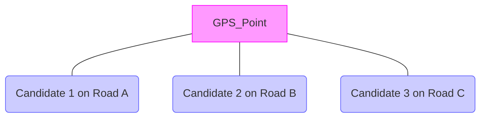
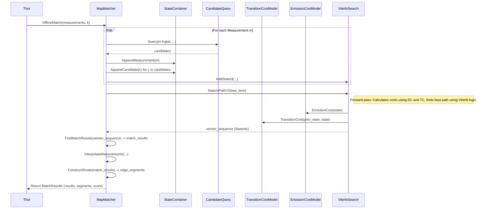

# Chapter 10: MapMatcher (Meili)

Welcome to the final chapter of our Valhalla core concepts tutorial! In [Chapter 9: DirectionsBuilder (Odin)](09_directionsbuilder__odin_.md), we saw how Valhalla generates turn-by-turn instructions from a calculated route path.

But what if you don't have a planned route? Imagine you just finished a drive and have a log of GPS points from your phone or car. This raw GPS data can be noisy – points might drift off the road, be inaccurate due to tunnels or tall buildings, or skip sections. How can you figure out *exactly which roads you actually drove on*?

This is where **Map Matching** comes in. Valhalla's `Meili` component, specifically the `MapMatcher`, specializes in taking these messy GPS traces and snapping them back onto the road network.

In this chapter, we'll explore:

*   What map matching is and why it's useful.
*   How `MapMatcher` (Meili) takes a GPS trace and finds the most likely path.
*   The roles of Emission and Transition costs.
*   How the Viterbi algorithm helps find the best path through possibilities.

Let's clean up those messy tracks!

## The Problem: Noisy GPS vs. Clean Roads

GPS data is fantastic, but it's rarely perfect. When you record a drive, you might get a sequence of coordinates that looks something like this:

```mermaid
graph TD
    subgraph Actual Road
        direction LR
        R1 --- R2 --- R3 --- R4 --- R5
    end
    subgraph GPS Trace
        direction LR
        G1 --- G2 --- G3 --- G4 --- G5
    end

    style R1 fill:#eee,stroke:#333,stroke-width:4px
    style R2 fill:#eee,stroke:#333,stroke-width:4px
    style R3 fill:#eee,stroke:#333,stroke-width:4px
    style R4 fill:#eee,stroke:#333,stroke-width:4px
    style R5 fill:#eee,stroke:#333,stroke-width:4px

    style G1 fill:#f9f,stroke:#f0f
    style G2 fill:#f9f,stroke:#f0f
    style G3 fill:#f9f,stroke:#f0f
    style G4 fill:#f9f,stroke:#f0f
    style G5 fill:#f9f,stroke:#f0f

    linkStyle 0,1,2,3,4,5,6,7,8 stroke-width:2px, stroke:#ccc
    linkStyle 9,10,11,12 stroke-width:2px, stroke:#f0f, stroke-dasharray: 5 5
```

*The blue line represents the actual road, while the pink dashed line is the noisy GPS trace.*

The GPS points (`G1`, `G2`, ...) might be slightly off the actual road segments (`R1`-`R5`). For analysis (like calculating average speed on specific roads) or visualization, we want to determine the most probable sequence of actual road segments the vehicle traveled. This process of "snapping" the trace to the road network is called map matching.

## `MapMatcher` (Meili): Cleaning the Trace

Valhalla's `MapMatcher` (part of the `Meili` component, named after a Norse god associated with travel) takes a sequence of input points (usually latitude, longitude, and optionally timestamps and accuracy estimates) and uses sophisticated algorithms to find the most likely sequence of road segments (`DirectedEdge` - [Chapter 3: DirectedEdge & NodeInfo](03_directededge___nodeinfo.md)) that corresponds to the trace.

**Analogy: Snapping to a Coloring Book**
Imagine the road network is a complex coloring book page with lots of lines. Your GPS trace is like a shaky line someone drew roughly following the picture. Map matching is like taking that shaky line and snapping it precisely onto the closest lines in the coloring book, creating a clean version that perfectly follows the intended path.

**Input:** A sequence of `Measurement` objects (lat/lon, time, accuracy).
**Output:** The most probable path(s) on the road network, represented as a sequence of `MatchResult` points (snapped coordinates on edges) and `EdgeSegment`s (pieces of road segments used in the path).

## Key Concepts in Map Matching

How does `MapMatcher` figure out the *most probable* path? It involves weighing different possibilities using costs and a clever algorithm.

**1. Candidates:**
For each GPS point in the input trace, `MapMatcher` first finds potential road segments nearby. These are called **candidates**. Just like in [Chapter 1: Location & PathLocation](01_location___pathlocation.md), it searches the graph data ([Chapter 2: GraphTile & GraphReader](02_graphtile___graphreader.md)) within a certain radius of the GPS point. There might be several candidates for each point.


*A single GPS point might have multiple candidate points on nearby roads.*

**2. Emission Cost (`EmissionCostModel`):**
This answers the question: "How likely is it that this specific GPS point corresponds to this specific candidate point on the road?"
*   It's primarily based on the **distance** between the GPS point and the candidate point. The closer they are, the lower the cost (more likely).
*   It also considers the reported **GPS accuracy**. If the GPS reports low accuracy, the cost increases more slowly with distance.
*   The `EmissionCostModel` (`meili/emission_cost_model.h`) calculates this cost. A low emission cost means the candidate is a good "fit" for the GPS point's location.

**3. Transition Cost (`TransitionCostModel`):**
This answers the question: "How likely is it to travel *between* candidate A (for GPS point 1) and candidate B (for GPS point 2)?"
*   It compares the **route distance** between candidate A and candidate B (calculated by finding a short path using costing like [Chapter 5: DynamicCost (Costing)](05_dynamiccost__costing_.md)) with the **straight-line distance** (or time difference) between GPS point 1 and GPS point 2.
*   If the route distance is very different from the straight-line distance between the GPS points, the transition cost is high (it's unlikely you took that route).
*   If they are similar, the cost is low (a likely transition).
*   The `TransitionCostModel` (`meili/transition_cost_model.h`) calculates this cost. A low transition cost means traveling between those two candidates seems plausible given the GPS movement.

**4. Viterbi Algorithm (`ViterbiSearch`):**
Now we have costs for matching points (emission) and moving between points (transition). But how do we find the *sequence* of candidates that minimizes the total combined cost across the entire trace?
*   The Viterbi algorithm is a standard technique used in map matching (and many other fields like speech recognition).
*   It efficiently explores the possible connections between candidates at consecutive GPS points, keeping track of the lowest cumulative cost to reach each candidate.
*   It builds a structure (often called a trellis) representing states (candidates at each time step) and transitions.
*   By working forwards through the GPS points and then backtracking from the end, it finds the single sequence of candidates (one for each GPS point) that has the lowest overall cost.
*   Valhalla implements this in `ViterbiSearch` (`meili/viterbi_search.cc`).

## Using `MapMatcher`: The `/trace_route` Action

Valhalla exposes map matching functionality primarily through the `/trace_route` and `/trace_attributes` API actions. You provide the GPS trace (as a `shape`) and some configuration options.

**Example Request (Conceptual):**

```json
{
  "shape": [ // Sequence of GPS points
    {"lat": 40.123, "lon": -75.456, "time": 1678886400},
    {"lat": 40.124, "lon": -75.457, "time": 1678886405, "radius": 15}, // Optional accuracy radius
    {"lat": 40.125, "lon": -75.458, "time": 1678886410},
    // ... more points
  ],
  "costing": "auto", // Which costing model rules to use for routing between candidates
  "shape_match": "map_snap", // Use the map matching algorithm
  "trace_options": { // Optional parameters influencing matching
    "gps_accuracy": 10, // Default GPS accuracy in meters
    "search_radius": 50, // Max distance to search for road candidates
    "breakage_distance": 60, // Max distance between GPS points before considering a break
    "interpolation_distance": 5 // Distance threshold for interpolating points vs. matching them
  },
  "alternates": 0 // Number of alternative matches to return (0 means just the best one)
}
```

**Simplified Workflow within Valhalla (`thor_worker_t::trace_route` -> `thor_worker_t::map_match`):**

1.  The `Actor` receives the request ([Chapter 8: Actor & Workers (Loki, Thor, Odin)](08_actor___workers__loki__thor__odin_.md)).
2.  `Loki` performs initial checks and setup (`loki_worker_t::trace`).
3.  `Thor` takes over (`thor_worker_t::trace_route`). Since `shape_match` is `map_snap`, it calls `thor_worker_t::map_match`.
4.  Inside `map_match`, it gets or creates a `MapMatcher` instance (`meili::MapMatcherFactory`).
5.  It calls `matcher->OfflineMatch(trace, k)`, where `trace` is the vector of `Measurement` objects and `k` is the number of paths requested (usually 1).
6.  `OfflineMatch` performs the core map matching logic (candidates, costs, Viterbi).
7.  `OfflineMatch` returns the best match(es) as `MatchResults` (containing `MatchResult` points and `EdgeSegment` path).
8.  `Thor` converts this matched path into a standard `TripLeg` structure (`thor_worker_t::build_trace` or `build_route`).
9.  `Odin` generates narrative directions if requested ([Chapter 9: DirectionsBuilder (Odin)](09_directionsbuilder__odin_.md)).
10. The `Actor` returns the final result (which looks similar to a regular route response, but follows the matched path).

**Output (Conceptual JSON Snippet):**
The output will resemble a standard route, including a `trip` with `legs`, `summary`, and `shape`. The key difference is that the `shape` and maneuvers follow the path determined by map matching the input trace, not necessarily the fastest or shortest route between the start and end points. It might also include information about which input trace points correspond to which parts of the matched route.

## Internal Implementation: `MapMatcher::OfflineMatch`

Let's peek under the hood of `meili::MapMatcher::OfflineMatch`.

1.  **Prepare Input (`AppendMeasurements`):**
    *   Processes the input `measurements`.
    *   Groups very close points together for interpolation later (to improve performance).
    *   For each point *to be matched*, calls `AppendMeasurement`.

2.  **Get Candidates (`AppendMeasurement`):**
    *   For a given `measurement`, calls `CandidateQuery::Query` to find nearby road segments within the search radius.
    *   Stores the measurement and its candidates in the `StateContainer`.

3.  **Viterbi Search (`vs_.SearchPathVS`):**
    *   This is the core of the Viterbi algorithm.
    *   It iterates through time steps (measurements).
    *   For each candidate (`StateId`) at time `t`, it considers transitions from candidates at time `t-1`.
    *   It calculates `EmissionCost` for the candidate at time `t`.
    *   It calculates `TransitionCost` from each potential predecessor at `t-1`.
    *   It updates the minimum cumulative cost to reach the candidate at time `t` and stores the best predecessor.
    *   Uses a priority queue (`DoubleBucketQueue`) to efficiently explore states with the lowest current cost.

4.  **Backtrack & Find Best Path:**
    *   Once the forward pass is complete, `SearchPathVS` finds the winning candidate at the last time step.
    *   It then backtracks using the stored predecessors (`Predecessor()`) to reconstruct the sequence of `StateId`s representing the most probable path through the candidates.

5.  **Get Match Results (`FindMatchResults`):**
    *   Takes the winning sequence of `StateId`s.
    *   For each `StateId`, determines the corresponding `MatchResult` (the snapped point, edge ID, distance along edge, etc.) by examining the path segments connecting the chosen states.

6.  **Interpolate Points (`InterpolateMeasurements`):**
    *   For points that were initially skipped (too close together), it interpolates their position along the matched path segments between the surrounding matched points.

7.  **Construct Route (`ConstructRoute`):**
    *   Combines the `MatchResult` points and the routes found between them into a final sequence of `EdgeSegment` objects, representing the complete matched path geometry and edge sequence.

8.  **Return `MatchResults`:**
    *   Packages the final list of `MatchResult` points (including interpolated ones), the `EdgeSegment` path, and the overall score into a `MatchResults` object.

**Simplified Sequence Diagram (`OfflineMatch`):**



**Code Snippets:**

*   **Adding States (`AppendMeasurement` -> `ViterbiSearch::AddStateId`):**
    ```cpp
    // File: meili/map_matcher.cc (Conceptual in AppendMeasurement)
    const auto& candidates = candidatequery_.Query(...); // Get candidates
    const auto time = container_.AppendMeasurement(measurement);
    for (const auto& candidate : candidates) {
      const auto& stateid = container_.AppendCandidate(candidate); // Store candidate
      vs_.AddStateId(stateid); // Add to Viterbi search space
    }
    ```
    This finds candidates near a GPS point and registers them with the Viterbi search system.

*   **Viterbi Forward Pass (`ViterbiSearch::IterativeSearch` Simplified):**
    ```cpp
    // File: meili/viterbi_search.cc (Conceptual)
    while (!queue_.empty()) { // Priority Queue of states to explore
      const auto label = queue_.top(); // Get lowest cost state label
      queue_.pop();
      // ... check if already processed or too early ...

      scanned_labels_.emplace(label.stateid(), label); // Mark as visited

      // Find winner for this time step if not already found
      if (winner_by_time.size() <= label.stateid().time()) {
        winner_by_time.push_back(label.stateid());
      }
      // ... check if target reached ...

      // Add Successors: For each potential next_stateid
      for (const auto& next_stateid : /* states at time+1 */) {
        const auto emission_cost = EmissionCost(next_stateid);
        const auto transition_cost = TransitionCost(label.stateid(), next_stateid);
        const auto next_costsofar = CostSofar(label.costsofar(), transition_cost, emission_cost);

        if (!IsInvalidCost(next_costsofar)) {
          queue_.push(StateLabel(next_costsofar, next_stateid, label.stateid())); // Add successor
        }
      }
    }
    ```
    This shows the core loop: explore the best candidate, calculate costs to its successors using the cost models, and add valid successors to the queue.

*   **Backtracking (`SearchPathVS` -> `Predecessor`):**
    ```cpp
    // File: meili/viterbi_search.cc (Conceptual in SearchPathVS)
    StateId current_winner = vs_.SearchWinner(last_time); // Find winner at end
    while (current_winner.IsValid()) {
      state_ids.push_back(current_winner);
      current_winner = vs_.Predecessor(current_winner); // Go to previous best state
      if (time == 0) break; // Reached start
      time--;
    }
    std::reverse(state_ids.begin(), state_ids.end()); // Put in correct order
    ```
    After finding the best state at the end, this uses the stored `predecessor` links to trace the path back to the beginning.

## Conclusion

Map matching, powered by Valhalla's `Meili` component and the `MapMatcher`, is a powerful technique for transforming noisy GPS traces into clean, accurate paths on the road network.

*   It finds **candidates** (nearby road points) for each GPS measurement.
*   It uses **Emission Cost** to measure how well a candidate location matches a GPS point.
*   It uses **Transition Cost** to measure how plausible travel between candidates is.
*   The **Viterbi algorithm** efficiently finds the sequence of candidates with the lowest total cost.

This allows for accurate analysis of past trips, visualization on maps, and can even be used for real-time navigation systems to understand the user's current position more reliably.

This concludes our journey through the core concepts of the Valhalla routing engine! We hope this series has given you a solid foundation for understanding how Valhalla works, from matching locations and reading map data to finding the best paths and generating directions. Happy routing!

---

Generated by [AI Codebase Knowledge Builder](https://github.com/The-Pocket/Tutorial-Codebase-Knowledge)