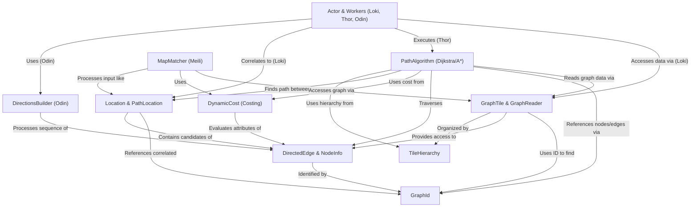

# Tutorial: Valhalla

Valhalla is an open-source **routing engine** that takes *user requests* (like origin and destination points) and finds the *best path* through a detailed road network dataset. It breaks the map into smaller, manageable **Tiles** (like chapters in a map book), uses efficient **Graph IDs** to reference road segments and intersections, and calculates the "cost" (like time or effort) using different **Costing** models (car, bike, walk). It employs **Path Algorithms** (like A* search) to explore the network efficiently, organized in a **Tile Hierarchy** for faster long-distance searches. Specialized components handle tasks like correlating user points to the actual road network (**Loki**), calculating the path (**Thor**), generating turn-by-turn directions (**Odin**), and matching GPS traces to roads (**Meili**).

**Source Repository:** [https://github.com/valhalla/valhalla/tree/master/src](https://github.com/valhalla/valhalla/tree/master/src)

## Chapters

1. [Location & PathLocation](01_location___pathlocation.md)
2. [GraphTile & GraphReader](02_graphtile___graphreader.md)
3. [DirectedEdge & NodeInfo](03_directededge___nodeinfo.md)
4. [GraphId](04_graphid.md)
5. [DynamicCost (Costing)](05_dynamiccost__costing_.md)
6. [PathAlgorithm (Dijkstra/A*)](06_pathalgorithm__dijkstra_a__.md)
7. [TileHierarchy](07_tilehierarchy.md)
8. [Actor & Workers (Loki, Thor, Odin)](08_actor___workers__loki__thor__odin_.md)
9. [DirectionsBuilder (Odin)](09_directionsbuilder__odin_.md)
10. [MapMatcher (Meili)](10_mapmatcher__meili_.md)

---

Generated by [AI Codebase Knowledge Builder](https://github.com/The-Pocket/Tutorial-Codebase-Knowledge)